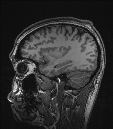

  
  **[:arrow_left: Previous Section][Prev] | [Table of Contents][TOC] | [Next Section :arrow_right:][Next]**
  

---

## 1.2.4 Empathy, Sympathy, and Solidarity

A sense of empathy is only feasible when episodic memory is evoked, from learning about things that another person has genuinely lived through, or is currently going through in their life. Furthermore, functions of the cerebellum, and the medulla are necessary to experience empathy because those regions of the brain are more strongly related to memories created from embodied movements within a physical region of space and time. Hence, the concept of a time-bound episode, includes various details about the bodily sensations from a place with its sequence of events. This means that a person who can empathize with another person's lived experiences, has necessarily been through those experiences, in the most tangible and similar way possible. This is why there isn't a way for a male person to ever empathize with the situation of experiencing childbirth, via the gestation period of a pregnancy. A biologically male human being, simply has no memory about ever having been pregnant to rely upon, in order to be able to empathize with a biologically female human being, who has been through physical experiences like mensuration, abortion, or childbirth. 

A person who has not been through a particular physical experience, can at best sympathize with another person upon learning about his or her situation, by drawing inferences from memories of events that are reasonably similar to the other person's situation. Feelings of sympathy tend to involve a state of comprehension and pity, about a person's lived experiences. Sympathizing with one's self can happen, but empathizing with self is not feasible, because empathy is strictly a feeling for another person through vicarious understanding of what that other person has, or is going through. 

Feelings of sympathy and empathy can also be about jubilation, and not only about experiences of challenges, and of loss, pain, or suffering. Not being able to sympathize or empathize with anyone else, makes a person oblivious to their social surroundings. However, being devoid of the capacity to sympathize and empathize with any other person, while not being dead or in a coma, is a very rare occurrence, and chances are that we may never be able to empathize with what it feels like, to be utterly oblivious. 

The above-mentioned sentences might not have been the expected approach to considering what empathy is, or isn't. What's more, those sentences haven't yet been qualified as scientifically true, with references and citations. So, let's explore the topic of memory from the perspective of cognitive neuroscience, to better understand the core emotions called sympathy, and empathy, that are supposedly necessary, for any human being to actually be humane, morally upright, and just. 

Types of [consciously retrievable memories](https://en.wikipedia.org/wiki/Memory) include: 

1. Semantic memory of a person related to factual things, or tropes, that can have a word associated with them, in a language or an encrypted code known to the person's speech community. Examples of semantic memory can be, "Everest is a mountain while the Pacific is an ocean", or, "Speedy unicorns aren't always hungry for juicy apricots." Memory of such trivia or codes, <ins>need not</ins> be associated with any kind of a physical setting, or time period, or a place the person has physically visited. Such memories also don't include any recollections of bodily movements or physical sensations. 

1. Procedural memory is related to sequence of steps involved in doing something. For example, "To bake a good, well-formed cake, measure out, sift, and mix dry ingredients separately from the wet ones, and later combine the two carefully and slowly, before transferring them into a suitable baking dish, when following any baking recipe (including ones for [making solid rocket fuel](https://youtu.be/E0bnPb1WIuc))." Rocket science and brain science aren't that difficult or complicated. 

1. Episodic memory pertains to lived experiences involving interactions with people, places, or things, at a particular point in a person's life. For example, "What happened on the day I was illegitimately arrested and detained by Waterloo Regional Police Services, and the ways in which I was violated by public service personnel during the subsequent days of that arrest, is explained in *The File,* to the best of my recollection and abilities."  

Before I continue into deeper scientific explorations about memory, and showcase how long-standing institutional malfeasance has corrupted the way neuroscience is taught and utilized throughout Westernized nations, let me briefly speak about solidarity. 

>**Solidarity is the act of knowingly and willingly taking up responsibility, on behalf of persons one sympathizes or empathizes with.** 

 
 

Please click the <image width="1%" src="https://github.com/callthis/tabloid/blob/main/imgs/solid_white-pointing_right-triangle.png"></image> icon below, to read about deep-end neuroscience.

<h3>1.2.4.1 Dishonesty and Cheating within Brain Imaging Studies</h3>

And now, let us explore the ways in which "peer reviewed" brain imaging studies from 'august institutions' have deliberately squandered **billions** of tax-payer dollars over the past two decades, by using fabricated data to promote false narratives about the basis of healthy cognition. 

Fabricated data included in brain imaging studies have continued to be manually fashioned to fit the worldviews of Anglo-Saxon religiosity and folklore, with moralistic undertones for justifying institutionalized racism and sexism. This is only one more way in which supremacists have continued to usurp cultural authority, for the purposes of marginalizing, criminalizing, or pathologizing targeted people's outlook and articulations, by repackaging racism from [phrenology](https://en.wikipedia.org/wiki/Phrenology) as, "state-of-the-art behavioral and cognitive neuroscience." One of their frequently used methods in doing so, has involved the use of manually tuned data from brain imaging studies which, promote their racist narratives within sciences. 

The following episode from my life being retold here, is from the year 2014. It is about particular individuals employed by certain universities in the US, UK, Germany, Italy, and India, who tried to force me to fabricate data for them, so that they could have the results from their experiments fit the already popularized narratives promoted by their publicly funded research labs. The experiments involved study of brain physiology using Functional Magnetic Resonance Imaging ([fMRI](https://en.wikipedia.org/wiki/Functional_magnetic_resonance_imaging)).  

The main steps in their experiments pertaining to [cognitive neuroscience](https://en.wikipedia.org/wiki/Cognitive_neuroscience), [experimental psychology](https://en.wikipedia.org/wiki/Experimental_psychology), [psychophysics](https://en.wikipedia.org/wiki/Psychophysics) and [psychometric tests](https://en.wikipedia.org/wiki/Psychometrics) involved: having a voluntary human subject perform few verbal, visual, or haptic tasks while the subject's brain was being scanned inside an fMRI machine. Each session with a test subject could last up to an hour. And approximately 18 to 25 sessions would be conducted over a period of a few weeks using 5 or 6 different participants. All participants were cognitively intact adults, and did not have any medical conditions that would have prevented them from living a healthy lifestyle. 

 

    </img>
     
    <b>This is not Homer Simpson!</b>

 

The research experiments that I was employed to work on, were conducted in Rovereto, Italy, using a 4 Tesla fMRI machine. The above image is a scan of my cranium from June-2014, using the 4 T fMRI machine in structural MRI mode, which was not taken for clinical purposes, and was only taken for registering all other fMRI scans of my brain during psychometric experiments for subsequent image processing, statistical analysis, and research. Here are important details pertaining to those publicly funded studies, which might be more meaningful and useful to researchers and scientists involved in neuroscience. 

1. Construction of the custom built research facility along with the 4 Tesla fMRI machine had a cost of approximately €230 million Euros, and each session to run the machine costed approximately €2,600 (two thousand six hundred Euros) per hour. Then there was the cost of salaries for all of the researchers, and technicians wherein: professors had an annual salary of €65 to €80 thousand Euros, medical technicians were paid somewhere around €48 thousand Euros per year, and graduate research assistants were paid a stipend of €15 to €24 thousand Euros per year. At the time I was working at the facility near Trento, Italy, there were around four professors, two medical technicians, and a dozen research students who regularly conducted approximately 800 hours of experimentation per year. 

1. Since the 1980s, throughout the world, fMRI scans for research purposes have typically left out the cerebellum from data pertaining to the [human brain](https://en.wikipedia.org/wiki/Human_brain). This is because the size of the scanning machines have remained so small, that a person's torso can barely fit into the scanning chamber. When high resolution scans of the cranium are taken, either a portion of the cerebrum gets cut out, or that of the cerebellum as well as the medulla gets chopped from the scanned images. So, researchers in this field of empirical studies have deliberately chosen to leave out the cerebellum and the medulla, to focus on the anatomy and physiology of the cerebrum. Only for clinical purposes with lower resolution physiological scans in an fMRI, or in structural scans using MRI mode, can one see the entire brain of a person. 

1. Another reason why the cerebellum and the medulla cannot be analyzed simultaneously with scans of the cerebrum, is because the cerebellum is at least four times as dense as the cerebrum, and it has much higher frequency of activity than other parts of the brain. So, fMRI scans that are calibrated to focus on the amplitude and frequency of activities in the cerebellum, tend to wash out the data from the cerebrum. As such, fMRI scanners are tuned for the level of activity in the larger volume of the brain, that is, the cerebrum, rather than the highest density area of the brain, namely, the cerebellum. Consequently:

 

<b>Click here, if you'd like to dive even deeper, into a discussion about corruption within scientific publications</b>
 

1. Anything that you might have heard, or read about, regarding how the brain processes emotions, thoughts, and appetites; or about how aspects of an individual's brain can give rise to a person's behavioral, personality, and sexuality traits; happen to be incorrectly attributed, and that too, *only* to parts of the cerebrum, such as the frontal, parietal, occipital, and temporal lobes, or to the cingulate gyrus. 

1. Even the stuff you might have read about the brain in Wikipedia, or in peer reviewed journals, to this date, mostly have information that conveniently omits fMRI data about the cerebellum and the medulla. 

1. When the same set of experimental protocols used on alive human beings were tested on [a dead fish](https://en.wikipedia.org/wiki/Functional_magnetic_resonance_imaging#Criticism), statistically significant correlations between given stimuli, and activities in the brain of the dead fish, were recorded by the fMRI machine and noted by researchers. What this actually indicates is that, experimental protocols as well as the types of statistical analysis techniques, used in fMRI studies, have remained faulty; but researchers have continued to dupe funding agencies for continuing to do deliberately fraudulent experiments. The faulty results of fMRI studies have continued to be published within reputed journals of science, via cronyism, to cheat and defraud government based funding agencies, across multiple countries of the world. This multi-billion dollar, international-scale scam, has been going on for decades!

1. Through cronyism, a number of Western universities have maintained a monopoly on producing narratives about which part of the brain is more closely linked to a particular mental activity, and to a range of a person's physical skills and desires. Those narratives are fallacious, and only serve to boost the cultural authority of a few researchers like [Michael Gazzaniga](https://en.wikipedia.org/wiki/Michael_Gazzaniga) and [Giacomo Rizzolatti](https://en.wikipedia.org/wiki/Giacomo_Rizzolatti), who have been given the role of authority figures, and are treated as cultural heroes, within the fields of neuroscience and cognitive science; even though their research is merely an extension of phrenology. 

1. The work done by Giacomo Rizzolatti on the existence of ["mirror neurons"](https://en.wikipedia.org/wiki/Mirror_neuron) is particularly faulty and problematic, because in his 'seminal study' that 'proved' the existence of mirror neurons, he randomly chose to study approximately 250 out of trillions of neurons in a live macaque brain, using single cell recordings. His most widely publicized experiments involved forcibly training a macaque monkey on a physical task, under duress for many months, to then cut open the monkey's skull, and poke thin electrodes into the monkey's brain tissue to record electro-chemical activity of single neuron cells, while the monkey was repeatedly made to perform the trained tasks. In such animal experiments involving live, single cell recordings, the animal dies in a few days because of the irreversible cranial surgery. Upon completing the single cell recordings from randomly chosen portions of the pre-frontal cortex of a monkey's brain, Rizzolatti claimed to have arrived at 'an empirical proof' suggesting that, the same set of neurons were activated when the monkey performed physical tasks of pushing or lifting objects, as well as when it watched a video of another monkey performing the same physical tasks. 

1. What were the rest of the trillions of neurons in the monkey's brain doing during Rizzolatti's experiments investigating the existence of mirror neurons? And why are such cruel experiments on animals even useful to human society? Well, all brain science textbooks have typically ignored both questions, and likewise, almost every popular neuroscience researcher has ignored the question about what the rest of the trillions of neurons were doing during Rizzolatti's animal experiments involving single cell recordings. However, the purpose of assuming the given 'proof' of the existence of mirror neurons from Rizzolatti's animal experiments as being valid and true, has to do with explaining the concept of "vicariousness" of bodily movements in human beings. 

    1. Fabricated answers derived from Rizzolatti's experiments for questions such as, do animals experience some kind of sensory stimulation when viewing videos of other animals, were extrapolated to the idea that human beings also have "mirror neurons" by virtue of being animals. The same type of experiments conducted on monkeys were then conducted on voluntary human beings, within universities and publicly funded labs in Canada, the US, the UK, Netherlands, and Italy; except that instead of cutting open a human skull and taking single cell recordings with electrodes, the experimental readings were taken using people put inside fMRI machines. 

    1. The names and affiliations of researchers working with fMRI based studies have been omitted here, to spare them some embarrassment. But their fMRI based experiments were basically designed like this example: people (mostly *voluntold* undergrads and colleagues), were asked to perform tasks such as moving a finger to push a button with their dominant hand, while their brain scans were taken using an fMRI machine. Then those people were shown videos of somebody else performing the same task, while a second set of fMRI images of each human subject's brain activity was recorded using the same fMRI settings. Upon comparing the two sets of images using statistical analysis involving ["Generalized Linear Models"](https://en.wikipedia.org/wiki/Generalized_linear_model), it was erroneously concluded that human beings also have mirror neurons. And then a magical leap was made by those researchers to suggest that human beings can vicariously feel another person's pain, when seeing someone else go through hardships, thus 'proving' that properly functioning mirror neurons are the 'neurological basis of empathy and healthy cognition.' 

    1. It must be emphasized here, that there is no such thing as mirror neurons in actuality, and the concept of a few clusters of "mirror neurons" in the brain functioning alongside trillions of "non-mirror neurons" to help human beings ape each other's social etiquette and behaviors, is an entirely fictitious and false narrative, promoted by old-school racists. 

    1. But more importantly, publications from the supporters of researches like Rizzolatti, have been popularized to showcase that Western scientific methodology and technological prowess, has come to resolve a deeply valuable and difficult to answer question about mechanisms of vicarious feelings, that has been fundamental to human neurology, psychology, and particularly sociology. Also, such publications are used as the basis for asserting that, people who aren't in agreement with, or empathetic to Western sentiments, are pathologically defective due to a lack of properly functioning "mirror neurons." The 'rationalizations' adopted by Western thought leaders, for diminishing and pathologizing non-Euro-centric cultural views and behaviors, come from the 'groundbreaking scientific work' carried out by the likes of Giacomo Rizzolatti. 

    1. Even though the concept of mirror neurons is entirely fictitious, and has been conjured up by old-school racists, its thrust is still used for describing the basis of empathy, and touted as a 'significant factor' within the neural basis of autism, in well known textbooks promoted by Westernized universities across the world. 

1. Furthermore, comparative analysis between different sets of fMRI studies, are often flawed and erroneous because researchers keep trying to compare 1 millimeter (mm) cube resolution images of the brain with 2 mm cube, or 3 mm cube resolution data, only to note that the comparisons did not yield any valid, or significant correlations. Much more problematic meta-analysis studies are the ones that do find a statistically significant correlation, between different sets of brain imaging data, that possibly could not have been, and still cannot be registered to the same units of spatio-temporal measurements. 

1. The fallacious nature of fMRI studies: begins with faulty experimental protocols; continues with erroneous image registration procedures for image processing; then proceeds with much more faulty and wrongful use of [Generalized Linear Models](https://en.wikipedia.org/wiki/Generalized_linear_model) on millions of non-linear, stochastic and chaotic data-streams; and finally produces results with magical leaps to conclusions from miserably expensive experiments. The same type of experimental protocols, image processing pipeline, and analysis techniques using fMRI machines can be applied to heart cells and the [celiac plexus](https://en.wikipedia.org/wiki/Celiac_plexus), to arrive at the very same level of statistical confidence in concluding that mirror neurons exist in people's chest and inside the stomach area, apart form existing in people's heads. 

1. The fact that fMRI based studies and publications are mostly wasteful, fraudulent, dodgy, and bogus, does not matter, as long as the majority of people within international cliques of neuroscience researchers, happen to wittingly or unwittingly buy into the belief that, they have been doing legitimate research work, in line with 'accepted' scientific methodologies, while using fMRI machines and Generalized Linear Models, for exploring various inquiries of 'scientific interest.' However, the reality is that tens of thousands of published research papers, thousands of master's theses, and hundreds of doctoral dissertations related to fMRI studies conducted in reputed institutions across the world, over the past two decades, have been entirely wrongful, unworthy, and fraudulent. 

1. In contrast to fMRI studies, Positron Emission Tomography ([PET](https://en.wikipedia.org/wiki/Positron_emission_tomography)) scans of cranial tissue across human subjects, for studying the metabolism of alcohol in the body, indicate that when formaldehyde produced from the digestion of alcohol reaches the cerebellum and the medulla, it causes the person to loose a sense of time, and to suffer memory impairments along with the inability to control fine motor movements. This means that the cerebellum and the medulla are rather important in regulating human behavior, memory recall, emotions, sense of space and time, mood, and conscious thought processes. Also, formaldehyde happens to be a neuro-toxin with high toxicity. If you are super enthusiastic about biochemistry and neuroscience, please see, Daviet et al. 2022, Mitoma et al. 2021, and Volkow et al. 1995: 

    - Daviet, R., Aydogan, G., Jagannathan, K. et al. (2022). "Associations between alcohol consumption and gray and white matter volumes in the UK Biobank." *Nature Communications, 13, 1175.* https://doi.org/10.1038/s41467-022-28735-5 https://www.nature.com/articles/s41467-022-28735-5 

    - Mitoma, H., Manto, M., and Shaikh, A.G. (2021). "Mechanisms of Ethanol-Induced Cerebellar Ataxia: Underpinnings of Neuronal Death in the Cerebellum." *Int. J. Environ. Res. Public Health, 18, 8678.* https://doi.org/10.3390/ijerph18168678 https://www.mdpi.com/1660-4601/18/16/8678 

    - Volkow, N., Wang, G. J., and Doria, J. J. (1995). "Monitoring the Brain's Response to Alcohol With Positron Emission Tomography." *Alcohol health and research world, 19(4), 296–299.* https://www.ncbi.nlm.nih.gov/pmc/articles/PMC6875743/ 

1. Who would even want to know about such physiological studies conducted using expensive PET and fMRI scans, when there are convenient folktales about the left-side of the brain being in charge of analytical thinking; the right-side, in charge of creativity; and the medulla or mid-brain, in charge of a person's so-called "primitive mind", or the "monkey mind." Those kinds of folktales aren't truthful in a scientific sense of what actually happens within our brains, because almost all parts of the brain are active and constantly communicating with various parts of the body, at all times, at millisecond frequencies. 

1. Additionally, disrupting the adrenal functions of a person by damaging the endocrine system using drugs like [Benzodiazapines](https://en.wikipedia.org/wiki/Benzodiazepine), also alters the so called "fight-or-flight response", and mood regulation of the drugged person that the so-called 'monkey mind' is supposed to be in charge of. Murdering the 'monkey mind' of a person, and causing "ego-death" by using chemical lobotomy or electrical shocks, while causing visceral harm to a person's reproductive organs via cunningly or forcibly administered toxic drugs, isn't called "therapeutic healthcare." 

1. Moreover, communication between parts of the brain and the rest of the body, aren't only dependent on amplitude of neuronal and [glial](https://en.wikipedia.org/wiki/Glia) cell activities, they are also dependent on the frequency and phase of analog electro-chemical signal streams, among neuron and gliocyte clusters. Physiological damage to those critical tissues and cellular pathways for healthy metabolism, can be permanent and irreversible, due to wrongful administration of toxic neuro-suppressants, hallucinogenics, and other psychoactive drugs. 

>As such, any group of people who can provide the most resounding 'scientific explanations' for the basis of thoughts, emotions, sexuality, and personality traits in human beings, can gain cultural authority and pre-eminence, throughout the 'meritocracy based technocratic world', and perhaps, even throughout modern history. And then, with that authority, they can conveniently dictate which 'stalk or race' of people are to be sterilized, or killed, in state-sponsored detention centers using surgical, electro-mechanical and biochemical methods administered by coordinated public-service units, in the name of promoting law and order, and for "making the world a better place!" 

 

To explain how I was prodded to generate fabricated data by supervising researchers who had employed me as a data scientist in 2014, I must first dwell into the image processing techniques involved in fMRI studies. The image processing pipeline for neuro-imaging studies goes somewhat like this: 

1. Create a design of experiment, with required policies, procedures, and protocols to have the design approved by an ethics committee for conducting experiments on human subjects. 

1. Recruit participants for becoming the test subjects of the study. They are usually compensated a nominal amount in cash for their time. The amount is usually not significant enough to be reported as a taxable income for the participants. However, it is a line item within the experiment's budget based on the number of hours each participant will spend in the experiment, multiplied by the number of participants needed for the study. 

1. Prepare each participant according to the protocols for being put into an fMRI machine. This usually has various steps to ensure the safety and privacy of the person being put into the scanning chamber. Foam and plastic fixtures are also used for keeping the subject's spine, neck, and head in a fixed position during scans. 

1. Take structural scans of the brain in MRI mode. These are usually 30 to 40 images in somewhat coarse thickness of 8 millimeter (mm) to 15 mm distance between each image taken at parallel slices of the brain. It typically includes accurate positioning data of the Rostrum and the Splenium at the [mid-sagittal](https://en.wikipedia.org/wiki/Sagittal_plane) section of the brain going through the [corpus callosum](https://en.wikipedia.org/wiki/Corpus_callosum). 

1. Take scans in fMRI mode, with particular technical settings of the machine chosen for the given protocols of the experiment being conducted. This usually produces images with a stream of time-series data at a resolution as high as 0.8 mm cube per 200 millisecond, on a 4 Tesla fMRI. However, 1 mm cube, or 2.3 mm cube per 600 millisecond are among commonly used settings, to be able to compare the images with ones taken from other 3 Tesla and 2 Tesla machines, that usually only have a maximum resolution of 1 mm cube, and 2.3 mm cube. 

1. Register all the fMRI images to the initial MRI image of the human subject, using template matching algorithms, and subtract the cranium as well as other tissue data, to obtain data pertaining to only the brain, but more specifically, only the cerebrum. This method of image registration is only useful and sensible for "a within-subject experiment design." 

    1. However, a much worse, yet popularly used method for image registration exists, wherein the fMRI images of a person are registered against the manually made atlas of an elderly French woman, who died in the nineteen-sixties. This is the [Talairach co-ordinate system](https://en.wikipedia.org/wiki/Talairach_coordinates) against which fMRI images are registered for the sake of 'uniform comparison' of brain scans, across human beings, and also across different vendors of MRI and fMRI machines. It is neither uniform nor a mathematically correct way to do image registration from a computer science perspective. But who really cares? 

    1. Yet another image registration method exists, wherein, the collected data is registered against a brain template with its novel coordinate system created by the McGill University's "Montreal Neurological Institute and Hospitals", in the nineteen-nineties. 

    1. All of these methods of image registration are proven to be utterly flawed, from a computer science perspective, because "affine transformations" are applied to the collected fMRI images of all human test subjects, via template matching algorithms that use lossy-data-compression, to make those fMRI images conform to either the low-resolution 'map' of an elderly French lady's deteriorated brain, or to an 'average brain' created by averaging the 1.5 Tesla MRI scans of 100 adult patients from Canada. 

    1. The process of image registration, among such brain imaging studies, also causes high-resolution images of 2048x2048 pixel, 64 bit data, collected from instruments like an expensive 4 Tesla fMRI machine, to become as pathetic and useless as, 24x24 pixel, 12 bit MRI scans from obsolete 1990's equipment, with data-compression artifacts like ["chirping"](https://en.wikipedia.org/wiki/Chirp), and down-sampling artifacts like ["aliasing"](https://en.wikipedia.org/wiki/Aliasing), being introduced into the final 24x24 pixel images, mangled via affine transformations. Practically, 99% of the collected data from fMRI scans is shredded and thrown away, by this algorithmic, image processing (mis)step. 

    1. Subsequently, the mangled fMRI data is compared across test subjects, by claiming that they have been registered against, and squared up with, 'the corner stone' of brain imaging studies, that is, the low-resolution MRI image of an 'average brain' derived from Canadian patients in Montreal from the nineteen-nineties. This type of idiocy has been rampant throughout brain imaging studies, across international institutions, for decades.  

1. Feed the data obtained from the previous image processing step into machine learning algorithms such as: K-Nearest-Neighbor (KNN algorithm) with a Gaussian smoothing kernel and a radial basis function. The parametric value of "K" in the KNN algorithm and that of the radial basis, are chosen somewhat arbitrarily. The use of this image processing step is to further smooth out high frequency noise in the data. It can however smooth out, or erase, important details in the computationally processed images, if the parametric values of such algorithms are chosen improperly. Since, human beings have never actually known what level of detail, and "optical focus" needs to be used for the study of brain tissue, the parameters of the image processing algorithms are adjusted using manual intervention and tuning, to make the final output images look aesthetically pleasing to researchers. 

1. Then, chain the previous step with any number of statistical analysis techniques like Generalized Linear Models, multi-variate regression, and any other modification of statistical techniques used for time-series data analysis, to identify correlations between stimuli-and-reaction. The stimuli are the visual, auditory, or haptic inputs presented to the test subject during the experiment at specific intervals of time, and the reaction is supposed to be the physiological response observed in the test subject's brain, at or near those time-stamps. 

1. Here I'd like to add a note about row-major versus column-major matrix operations in machine learning computations. I don't know if I will be able to explain this properly in lay terms, but this issue fundamentally impacts all fMRI based research that has ever been, and is current being conducted. 

    1. When data is represented in a 2-D matrix, the human mathematician is faced with the choice of indexing each element in the matrix by either prioritizing rows, or columns. This unavoidable choice is called [row versus column-major ordering](https://en.wikipedia.org/wiki/Row-_and_column-major_order). 

    1. Computer software and programming environments like Matlab happen to use column-major indexing as a default setting (See, [Matlab Array Layout](https://www.mathworks.com/help/simulink/ug/code-design-for-row-major-array-layout.html). This is inline with computer programming needs of signal processing applications dealing with "linear-time-invariant systems." 

    1. However, fMRI data concerning the brain or any other part of the body, isn't linear-time-invariant. This fact and its significance, of course does not matter to professors in psychology and sociology who get to hire a 'code monkey' as a graduate research assistant to do computer programming for them. 

    1. When the fMRI data in a 3-D array is serialized, Matlab uses its default method of going through columns along "Z-Axis" of the array, first, then through the "Y-Axis", and lastly the "X-Axis." Subsequently, image processing steps involving a chosen smoothing kernel is used for applying ["convolution"](https://en.wikipedia.org/wiki/Convolution) over the serialized data-stream. Here, a researcher gets to choose the shape of a smoothing kernel to obtain desired output images. There is no consensus about which kernel and interval size is appropriate for doing the convolution operation. Coders simply choose the default settings of an existing image processing package, but some tweak this to speed up computations without considering the impact on final output of such mathematical operations. This is one of the main reasons why different sets of studies across subjects simply cannot be correlated to arrive at a scientific consensus, about the interpretation of final images obtained from fMRI scans. 

    1. In the above step, there is one more fundamental flaw that causes all fMRI studies in cognitive neuroscience to become completely useless when comparing the studies conducted across different research labs. That flaw has to do with the fact that some vendors of fMRI machines designate columns in their images as X-Axis, while others use rows as X-Axis, as the default setting in the machine's output. When image processing algorithms are applied for serializing scanned ["voxels",](https://en.wikipedia.org/wiki/Voxel#Data) the obtained result becomes silently erroneous, because the coordinates of the voxels simply cannot be overlaid and matched correctly, across studies. But, human researchers <ins>cannot</ins> notice this error in the output images and they continue to wrongly compare outputs from different fMRI machines that happen to have incorrectly underlying voxel layouts. For emphasis, I'm gong to try to explain this issue in as simple terms as possible: The voxel data at a coordinate location of (x5,y2,z8) obtained from one machine with a human-subject's brain scans, ends up getting erroneously compared by neuroscience researchers with data pertaining to (y5,x2,z8), obtained from another machine with another human-subject's brain scans. 

    1. So, sometimes those researchers report that they could not find expected correlations among brain scans across subjects, to reject their study's hypothesis. But sometimes, quite miraculously, researchers find 'high correlations' between such fundamentally incompatible data, to accept their study's hypothesis. The computational method of arriving at a conclusion to accept or reject their study's hypothesis, was fundamentally flawed, but those flaws cannot be seen in output images which merely happen to be diagrams with blobs of pretty colors on a silhouette of a brain. 

    1. Then it gets worse, some researchers deliberately tweak the default settings and choose to serialize the voxel data, for subsequent image processing steps, using a "raster pattern" that goes from Z-Axis, to Y-Axis and then X-Axis; while others deliberately choose the order as Y-Axis, X-Axis and then Z-Axis. And, some other researchers, choose to use much more arbitrary computational methods to serialize and smooth out data-streams obtained from EEG (Electroencephalogram), MEG (Magnetoencephalogram), fMRI, and MRI machines. All of those researchers then try to compare their results with each other, to come up with utterly spurious conclusions.   

1. As such, obtaining any kind of a correlation between stimuli-and-response in such studies is extremely challenging, because the physiological activities in the brain aren't "linear and discrete" on-off mechanisms. Furthermore, each person's brain has significantly large biochemical and physiological differences which impact the density, position, and rate of activity of neural cells within each millimeter cube of their brains. There are also philosophical issues pertaining to the fact that different parts of the brain, across individuals, are capable of performing the same "cerebral computation" or "thought process", using encoded changes within various clusters of neurons and glial cells. Worst of all, till date, none of these kinds of brain imaging studies have managed to explain the mechanism of how any type of "memory", is stored within brain tissue, even though neuroscience researchers still continue to try and explain, the physical and biochemical mechanisms of "memory processing" in brain tissue as "cognition", using faulty imaging techniques. 

1. The above-mentioned type of arbitrariness is used in brain imaging studies because who on Earth actually cares about what is right or wrong, within protocols of exploratory studies that use simplistic trial-and-error based approach to design of experiments. Furthermore, expensive items like fMRI machines are fancy new toys, that only a small number of universities on this planet can afford to have, for strictly research purposes, compared to hospitals that actually make more sensible use of such expensive machines, for clinical purposes. So, anybody who has scientific or technical objections to the way few privileged researchers can play around with data and big machines for publishing 'peer-reviewed' fMRI studies, can take a hike, or publish their concerns as a rebuttal paper in some magazine or a journal. The enterprise of churning out journal articles and rebuttals, thus keeps unscrupulous, unconscionable, unfaithful, wasteful, and fraudulent researchers employed in various universities across the world, in the name of conducting "scientific explorations of the human mind." 

1. To appear sophisticated and mathematically posh, such ill-informed and poorly educated, but socio-politically influential researchers, use a portion of the collected brain imaging data for training a machine learning model, on labels associated with the given stimuli and the experiment's protocols. Then, they use the remaining portion of the collected brain imaging data as a test set, which is input into the trained computer model, to see if the computer model will be able to accurately and precisely predict, that is, classify, the test dataset. 

    1. Till date, all such trained machine learning models for fMRI image classification for given stimuli have typically produced utterly worthless, and wrong predictions. This should have caused those wasteful researchers to pause, and properly learn more about the basics of statistical mathematics and computer science programming but, it isn't easy to **[teach professors and graduates in fields of psychology and business, to stop trying to cross red lines of ethics, engineering, and physical sciences](https://youtu.be/BKorP55Aqvg),** even though psychology and business can be taught to programmers, especially if the programmers happen to be "cognitive engineers" from military-sponsored labs, with original capabilities to produce neuro-linguistic programming. 

1. Most importantly, within such complex steps for raw-data acquisition, image processing, and machine learning based statistical analysis, a number of parameters belonging to the mathematical models and algorithms used for producing final results, simply don't pertain to any physical aspect of the imaging machine, nor to the biological processes being analyzed. Those parameters exist in machine learning algorithms for theoretical reasons from pure math, but they can be used for manually tuning and amplifying the signals within the scanned images, to produce fabricated data for generating desired end-results from neuro-imaging studies. It is at this stage that I was strongly prodded by my supervisors to manipulate the tuning parameters, and also to silently keep using their algorithmic models' illegitimate tuning parameters without rectifying them; so as to produce visualizations and results, that would match their preconceived notions and theories about 'causal factors' relating particular clusters of brain tissue, to particular cognitive functions in human beings.   

1. When I highlighted all such discrepancies to the Principle Investigators of the Italian University of Trento research lab that I was hired to work in, I was told by them to not *"go into the depths of the algorithms",* and to treat the algorithms as "a black-box" that had been "validated" by years of peer-reviewed "scientific research conducted by 'experts'." When I insisted that these fundamental faults had to be addressed, I was forced to consider joining a different lab in the University of Trento. I spent a few days in the more "computer engineering" oriented lab, where professors and graduate researchers working with [Diffusion Tensor Imaging (DTI)](https://en.wikipedia.org/wiki/Diffusion_MRI#Diffusion_tensor_imaging) machines had exactly the same objections with the other research group as I had presented. The people working with DTI told me that they had spent years trying to argue for better use of legitimate mathematics and computer science within MRI and fMRI based studies, but to no avail. They were repeatedly shut down by the fMRI research group using the argument that: philosophies and methods pertaining to psychology and sociology, could only be addressed by 'experts' who had doctorates and years of experience in those fields of study, and that computer science related issues in research methodology were not significant because those mathematical and engineering issues "canceled out", when considered across research groups. 

    1. The idea that systemic faults and errors simply cancel out via even more flawed statistical comparisons conducted across studies, was indeed one of the most idiotic arguments I have ever heard in my life. But, then I realized that if even tenured professors in computer science and mathematics departments had vehemently tried for years, only to repeatedly fail in making the fMRI researchers see the light of day, then what was I going to be able to do in that field of research as a 'novice?' 

    1. A few weeks later, I had to go back to the fMRI group that had hired me because they were still paying for my stipend and work visa through government based research grants. For another month, I continued to argue that it was unethical for me to knowingly manipulate and fabricate data to obtain desired output images to fit the fMRI group's research agenda. By the end of that month our social relationship had become severely strained. My doctoral work's advisor agreed with my concerns, but then, he spent a week trying to convince me to "accept the 'realities' of human society", and how I needed to go along with the organizational culture of the funding group because even if I thought that their methods were unethical and unprofessional, at the end of the day, I had to get paid by somebody, for doing some kind of a publishable work. I was told that I would not be allowed to publish or graduate if I did not comply. When I refused to yield, I was let go from the work position. 

>So, when I refused to fabricate research data, and to comply with dishonest methods for making the latest recorded fMRI scans support and corroborate the previously published peer-reviewed journal articles written by professors from the lab that had hired me, I was let go from the university's research scientist position. Let it be placed on the record that, the price of my integrity and loyalty isn't measurable in terms of social status, fame, or fortune, because it has never been for sale and will never be allowed to get bought by any persons, especially not by conniving fraudsters and cheats, through any means what-so-ever. 

There are indeed numerous foundational, ethical, methodological, and technical flaws as well as deliberate falsehoods incorporated within brain scanning based research associated with psychology and cognitive neuroscience. However, as I have mentioned earlier, those flaws and errors cannot matter to institutions and researchers profiteering from lies and prejudices, that have already become widespread within present-day scientific research work and literature pertaining to biological evolution, neurology, psychology, and sociology. Such issues are going to remain an impediment to earnest research and development work in all industries, as long as people go along with the ignoble treachery of propagating false narratives originating from Westernized universities, as being "honest, truthful, creditworthy, and reliable." Indeed, this is a seriously problematic international-scale issue in the education industry that degrades the work towards efficient research and development of worthwhile goods and services, wherein, influential funding agencies and researchers continue to pretend that their fallacious and flawed publications, have the highest degree of quality in terms of: modernity, utility, authenticity, and legitimacy across the entire world. 

A solution to curtail such duplicity, cheating, dishonesty, and felonies among publicly funded universities and research labs, could be to have researchers publish results from all of their experimental protocols, anonymized collected data, and analytics algorithms, to free and publicly accessible websites like *[arXiv](https://info.arxiv.org/about/index.html);* while making use of the document version-control software of a publicly accessible repository from GitHub, GitLabs, or BitBucket, to host all of the underlying content of a published paper. 

Making the data and implemented algorithms for generating statistical results publicly viewable, by using openly accessible online repositories, especially in sciences related to brain imaging and applied psychology, is currently the only practical and sensible way to economically scrutinize and validate those studies through crowd-sourced efforts. Subsequently, all online discussions and "pull requests" can also be version controlled and made publicly viewable, by using the "git workflow." Most importantly, citations for each line of analytical inputs and writing, as well as references to the collected empirical data and other research work on prior art, can be appropriately credited to those who make any contributions to research projects openly maintained online. (See, [git workflow](https://docs.github.com/en/get-started/quickstart/github-flow), and real-time collaborative online publishing [using git](https://www.freecodecamp.org/news/practical-git-and-git-workflows/))

Religiously or politically charged false narratives, arising from bogus studies conducted by influential cliques within popular and affluent institutions in the name of 'science', can thus be mitigated, by adopting better transparency and public accountability in actual sciences.  

 

---

  
  **[:arrow_left: Previous Section][Prev] | [Top :arrow_up:][Top] | [Next Section :arrow_right:][Next]** 
  
  **[Table of Contents][TOC]**

  [Prev]: ./01-02-03.md 
  [Top]: ./01-02-04.md#124-empathy-sympathy-and-solidarity 
  [Next]: ./01-02-05.md 
  [TOC]: ../README.md#table-of-contents 
  

