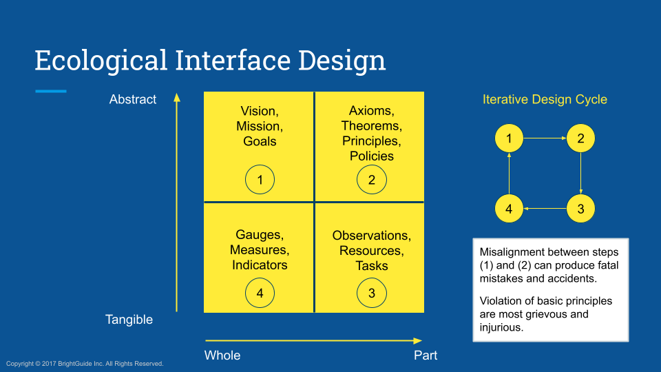
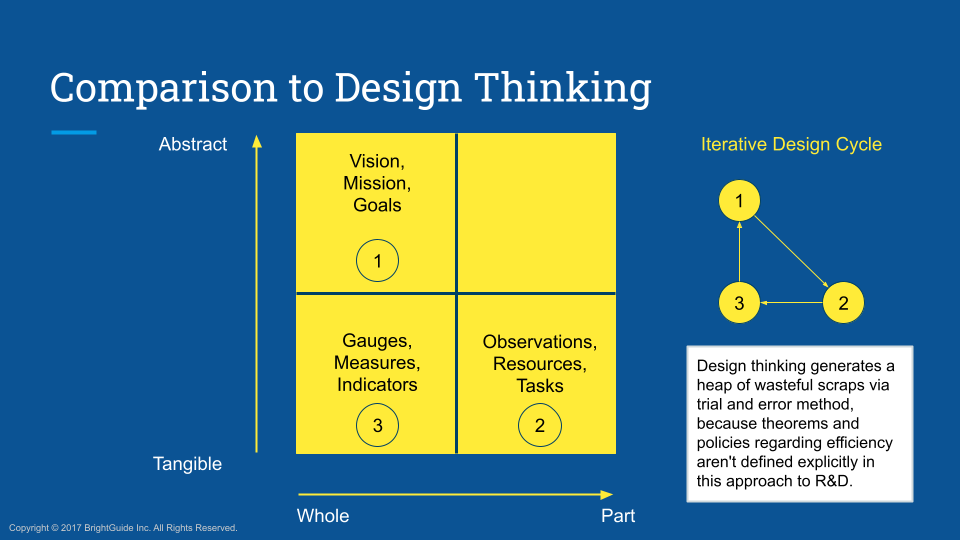

  
  **[:arrow_left: Previous Section][Prev] | [Table of Contents][TOC] | [Next Section :arrow_right:][Next]**
  

---

## 1.2.7 Zero-day Faults

>Zero-day faults, lead to the possibility of zero-day hacks. 

In the nineteen-eighties and nineties, the phrase "zero-day fault", meant that a foundational assumption, or a stipulation concerning the design and delivery of a system, was so hopelessly wrong, that the entire system had to be redesigned and rebuilt after taking it off-line, in order to rectify that error. In essence, a system with a zero-day fault, turns out to be fundamentally flawed from day one of its adoption and use in the hands of consumers, because of irreparable issues stemming from research, design, and deployment cycles preceding day one of its usage. 

Consequently, people who become adept at discovering, exploiting, and taking advantage of zero-day faults within telecommunications and supply chain systems, came to be labeled as hackers, by pop-culture authors; and those who took undue advantages of a system via unethical hacking, used to be labeled as crackers, by old-school *phreaks*. 

These days, the word ["hacking"](https://www.reddit.com/r/Unexpected/comments/yogv0z/life_hack/), has a wide variety of tropes, connotations, and meanings associated with it. 

However, the older generation's definition of zero-day faults, was modified and toned down drastically since the mid-two-thousands, when buzzwords like "cloud computing" and "machine learning" started being sold to enterprise clients of managed information technologies. How safe is your private and critical data, "in the cloud?" Only as safe as your behavioral hygiene with telecommunications devices that are connected to the public internet! 

The human-in-the-loop, is eventually the weakest, as well as the most conveniently overlooked link, in any socio-technical system.  

So, these days, the newer definition used among major cyber-security companies, to appease customers while covering the "company's downside", only alludes to the idea that, when an R&D based issue in a system sold to clients is detected and properly recognized, for which the company that sold the system is to be held responsible and liable, and only to the extent of having to provide a work-around or a patch for "mitigating the problem", then, the faulty software or hardware system being used by the company's known clients, can be addressed as "a zero-day error" or "a zero-day fault", if the satisfactory solution to the identified problem cannot be supplied within the terms stipulated within the "Service Level Agreement" contract. 

The fact that zero-day faults are practically irreparable, exist as an irreplaceable building block of the system due to engineering and managerial decisions made prior to the system's sale and usage, and can lead to a whole host of damages to stakeholders, were removed from all conversations and communications, throughout the cyber-security industry and markets. The focus was instead shifted to the strategy of replacing the entire system along with its faulty, fundamental component, with a newer 'compliant' version of the whole system, by completely reworking the system's architecture from scratch, to address the privately discovered problems and issues. Most importantly, such expensive and time consuming overhauls were to be done without letting the client feel the "psychological consequences" of learning about those types of changes, from any publicly syndicated records. The mantra followed by tech-giants, consulting firms, as well as start-ups simply became, "Forget the physical and socio-economic negative consequences suffered by gullible end-users, as long as 'the management and leadership' of the responsible company can be made to look innocent in the public's eye." And when that is not possible, do a bit of 'public relations damage control', to the extent that is 'reasonably justified and feasible', without creating a 'fuss.' 

Many other problematic issues that used to be labeled as zero-day faults, were eventually found to be reparable or replaceable, using newer technologies and innovations in the long-run, after suffering large-scale damages for decades. So, even computer operating system providers, and other big-tech and banking companies, became more cautious about labeling a discovered organizational or a technological issue, as a zero-day fault, by creating an "income tax-deductible fund" to absorb damages from their current and foreseeable mishaps. 

Examples of fundamental issues that can be labeled as zero-day faults include: 

- The global issue of the ways in which "narrow-gauge" railway tracks, are incompatible with "broad-gauge" and other types of railway lines, that are too difficult to replace or substitute, within the context of globalized logistics and transportation costs. 

    - Long-term losses due to inefficiencies in trying to bridge incompatible components of railway lines have continued to increase, and faltering railway companies in North America have only been able to stay operational due to communism-style, tax-payer backed subsidies. Eventually, the loss to tax-payers in North America will turn out to become so large that railway stations, locomotive vehicles, tracks, ticketing services, and manufacturing as well as maintenance infrastructure for passenger trains will have to be scrapped completely. The advantage of finally doing so will be to optimize railway lines for freight trains. However, quite naturally, a whole lot of blood-letting is going to continue within North American heavy industries that are tied to locomotives. In hindsight, African and Central Asian countries still have the opportunity to learn from such colossal screw ups of the North American locomotive industry and its associated bureaucracies, to commission and build their rail infrastructure.  

- The way in which a pair of crypto-currencies known as [Terra and Luna collapsed.](https://www.consumernotice.org/legal/crypto-bankruptcies/) Those digital currencies were tied to a fraudulent scheme developed by Terra blockchain's proprietors, which was being covered up by using slick marketing and sales tactics deployed by fiat-currency borrowers, who were trading currencies via that blockchain. Similarly, shady business practices of founders and executives, who have managed to repeatedly con the public with their "fake it till you make it attitude", include: [FTX, Genesis Global Capital, and Gemini Trust.](https://www.consumernotice.org/legal/crypto-bankruptcies/) 

    - Socio-economic losses suffered by public investors associated with Terra crypto-currency, was to the tune of $300 billion US dollars, which was wiped out in hours from global currency-exchange markets when the fundamental flaws within the company promoting that crypto-currency was exposed to the public. Losses to public investors from other crypto-coins and their associated monetary exchanges collapsing, merely within the year 2022-2023, has been more than $2 trillion USD. 

    - The worse problem here is of the tiny likelihood of speculative investors ever learning from such massive debacles, to become more careful and diligent in doing their research on vendors as well as markets that offer trades in crypto-currencies and non-fungible-tokens, before making the decision to invest in those types of digitally manufactured merchandise. Unfortunately for the world at large, too many gamblers who pretend to be investors in stock market shares, commodities, and other financial products, think that they will be the ones who will ultimately come out on the top, of the various pump-and-dump schemes orchestrated by them. 

In a more abstract yet tangible sense, from a systems perspective, a fault in a computer software such as a "multi-media player" that poses a security risk to its users, isn't as bad as a fault in the computer's hardware that could allow a remote user to take over the entire "workstation", or a "mainframe", during its boot sequence. Also, the process of quantifying the potential security threat, or exposure to various risks faced by end-users of a set of compromised systems, has more to do with the type and number of users who actively use the "overall system." 

So, when it comes to categorizing the "type of user", business operators who are a part of aerospace, defense, institutional financing, public utility, and public services sectors of an economy, are the type of people who handle a large volume of sensitive and critical data, at a highly frequent rate. The attributes of high frequency, large volume, critical and privileged data, due to the type of work that professional users engage in, distinguishes those workers from other customers of a system, who might otherwise have lesser access rights and user privileges to, say, a network of computers in an office building. 

Over the past two decades, as computer science and associated technologies have advanced exponentially across the globe, the likes of the US government and other international agencies, eventually came up with requirements for mapping all nodes of every telecommunication network, within three "degrees-of-separation" of denizens in their federal jurisdictions, for "security reasons." Here is what three degrees-of-separation implies for you: the contact list in your phone would constitute one degree-of-separation, your contacts' contacts would be two, and *their* contacts would be labeled as individuals within three degrees-of-separation from you, if you were to become a "person of interest", based on any kind of a retrospective or a preemptive reasoning applied by "an authorized security agency." 

As an example, and on a smaller scale, the task of tracking the online and on-ground activities of "interesting or consequential entities", is similar to counting the number of birds that exist within the metropolitan area of a given city, at any given time period; where in, usually, by the time one manages to count the birds (or mobile communications devices) within a geo-fence, some would have flown in, and others would have flown out, leaving a probabilistic estimate of the entities in need of being tracked. Now, simply expand that task to the entire scale of the planet and to: three degrees-of-freedom of every tagged 'bird', ('vehicle' or 'device'), that happened to enter into the 'sovereign territory' of any of the nations, which these days includes, the EU, the US, the UK, the UAE, Canada, Australia, Switzerland, South Korea, Japan, India, and Israel. 

For such gargantuan challenges in fulfilling the needs of large enterprise clients known as "international security agencies", a framework with a set of technical vocabulary for describing "human-machine interfaces" was devised in the late-nineteen-hundreds, by people who used to call themselves [cyberneticians or cyberneticists](https://en.wikipedia.org/wiki/Cyberneticist). These days they are simply called mathematicians, or physicists, analysts, or "[cybernetics](https://en.wikipedia.org/wiki/Category:Cybernetics) engineers." 

The work produced by cyberneticians and cyberneticists, eventually came to be popularized by various other systems engineers and researchers in the form of, "ecological interface design", so as to also accommodate interactions among non-human entities that may posses artificial intelligence (AI), generalized animal intelligence, swarm intelligence, and generalized human or humanoid intelligence. 

### 1.2.7.1 Ontological Methods in Systems Engineering 

[Ecological interface design](https://en.wikipedia.org/wiki/Ecological_interface_design) is considerably different than "design thinking", as the design and construction of ecological interfaces between nodes of an abstracted network of systems in an environment, starts with axioms of physics and mathematics that describe the given "complex socio-technical" ecosystem in analytical terms. Those sets of predicates, or descriptive statements of an ecology obtained via work domain analysis, are human as well as machine-readable. Whereas, statements discovered through trial-and-error based user-experience research in design thinking, are from a psychological, socio-political, economic, business and anthropological perspective, which are only human readable. The method of knowledge discovery used in ecological interface design, eventually incorporates all possible data that can be unambiguously addressed via any method of describing the "reality" of a situation, including geo-spatial and temporal aspects of an observable chain-of-events, from all humanly possible perspectives. 

 

     </img></img>
     
    <b>Ends <ins>do not</ins> justify the means, they only inherit the intent and quality of the means.</b>

 

The main use of ecological interface design has been in building "expert systems", and "enterprise resource management software tools", that are capable of managing trillions of nodes of a [mesh-network](https://en.wikipedia.org/wiki/Mesh_networking). 

The special set of methods and techniques from ecological interface design used for "knowledge discovery, and classification of a network's topology", eventually produce an ["upper ontology"](https://en.wikipedia.org/wiki/Upper_ontology) of physical things and socio-linguistic constructs pertaining to the given network of "autonomous and semi-autonomous agents." Also see, [Web Ontology Languages (OWL)](https://en.wikipedia.org/wiki/Web_Ontology_Language#Acronym)   

In particular, the use of ecological interface design principles and methodologies, used within the lab that I was employed in during the years 2008 to 2010, were for managing fleets of manned and unmanned military vehicles, plus, their operating and support personnel as well as associated resources. The word "resources", included strategic and tactical forms of physical, psychological, sociological, legal, and financial inputs for several sets of "missions", as well as documents and manuals pertaining to different models of equipment used by identifiable military units, along with "on-ground and online" modes of communication used among military personnel, staff, contractors, and defense R&D groups. 

>If you had to build a set of "real-time", enterprise resource management tools, for its associated telecommunications networks used by all wings of "the US military", for being deployed in a "Battle Theater" with active "Battle Zones", how would you go about researching and designing it, especially for rapid prototyping and testing of technologies usable within "provably earnest" missions? 

That type of a resource management tool had to answer difficult questions like, "What is the optimal way to produce individualized definitions for the scope of a situation, tailored for each autonomous agent exposed to an ongoing planetary-scale cybernetic war, which includes military positions and objectives in Earth's sub-surface as well as outer space regions?" In other words, "What type of knowledge, and inference, is to be made available to each active entity, within which format and modality, at which particular intervals of time and geographic locations, for achieving a predefined doctrinal goal, through a set of 'earnest and legally valid' objectives?" 

### 1.2.7.2 Doctrines are Unquestionable, Question Mark

What do you suppose could even be the most basic goal or a mission, for a state-sponsored apparatus operated by a federal government? 

For example, the goal or requirement of: "rapid production and continuous deployment of military grade technologies", has been a constant among supply chain members in the UK, Western Europe, and North America. This is because the US military and its allies are perpetually engaged in at least one multi-national war, at multiple battle fronts, and that too, merely for the sake of increased defense budgeting and expenditure year-over-year, as a driving force for America's economic growth towards — interplanetary supremacy. The aforementioned constant goal, has been, and is still being taken for granted, as the basic tenet adopted by the US federal government, in each-and-every conceivable geo-political scenario it comes into contact with, across the entire world. 

So, what might happen if something like "climate change", which many Canadian and US government officials are too quick to dismiss or deny, were to cause a 'dead-lock' to arise within various sections of the industrial supply chains used for advancing defense R&D projects of Northern Atlantic Alliances? 

Especially, what if that type of a dead-lock was imminent in brittle industry sectors linked to commercial airplane operators in Northern Americas and Western Europe, because [wholesale insurance companies, and international underwriters](http://home.treasury.gov/system/files/136/FIO-June-2023-Insurance-Supervision-and-Regulation-of-Climate-Related-Risks.pdf), have continued to keep increasing their premiums for home and business owners, based on flea ridden assumptions, and obsolete actuarial science models? Worse, imagine if super-insurers were to simply refuse to insure various geographic locations in North America due to increasing risks of flooding, wild fires, tornadoes, hurricanes, hail storms, sink holes, earth quakes, volcano eruptions, smog, wind sheer, and sleet? That would be a violation of a fundamental tenet that the US has taken for granted, wouldn't it? 

Undoubtedly, *force majeure* in the form of climate change, isn't going to impact the work undertaken by every vendor or supplier, within the industrial and military supply network of every country, in the same consequential manner. For instance, there are a number of suppliers who have had to back-down from supplying certain semi-conductor manufacturing equipment and components, to countries like Brazil, Russia, China, India, and South Africa, due to emerging threats posed by pandemics and climate change; and due to NATO's geo-political and socio-economic ambitions. This is one of the main, foundational issues currently being faced by Euro Zone economies that have already halted, or are halting exports to major markets of the world, because their trade deals with BRICS countries have become too deeply coupled to the effects of militaristic legislation adopted by the US and its allies, in contradiction to "norms and conventions of international free-trade agreements." 

Likewise, China might have decided to restrict the supply of raw materials like lithium, gallium, aluminum, copper, nickle, cadmium, cobalt, manganese, molybdenum, palladium and platinum group metals, rare-earth elements, machined components, as well as monetary credit, through its corporations and also through those of its allies, to industrial sectors like automotive manufacturing and real-estate construction, in countries like Australia and Canada. China's rationale for doing so might be stated simply as, "The Chinese Communist Party's need for protecting its national interests in the dynamically changing socio-economic, geo-political, and physical environment of ongoing international affairs." 

Can you imagine the levels of persistent unemployment and social distress, that destruction of equity and natural heritage will continue to generate, as a consequence of grid-locked supply chains worsening with wars and increasing climate disruptions throughout the world? 

However, those kinds of fiscal and monetary issues related to geo-politics and macro-economics, aren't as fundamental as getting the physics and mathematics right, in being able to properly answer the [stoichiometric](https://en.wikipedia.org/wiki/Stoichiometry) question:

>What amount of materials in kilograms are produced through the aerobic combustion of, one kilogram of a hydrocarbon like methane (CH4)? 

- You may use [these hints](https://en.wikipedia.org/wiki/Stoichiometry#Stoichiometric_air-to-fuel_ratios_of_common_fuels) about aerobic combustion of common fossil fuels for estimating an answer which, should include not only the gaseous products, but the liquid and solid ones as well, especially for fossil fuels like coal and biomass. One must also consider the amount of oxides of sulfur and nitrogen, that are dumped into the Earth's ecosystem from burning commercially supplied fossil fuels. 

The above question cannot be answered correctly, by most legislators, as well as military and business leaders from influential countries of our planet, even with all the hints and help provided to them. If they could, they would have realized by now, that: when approximately 80 billion metric tons (i.e. 80,000,000,000,000 kg) of fossil fuels are burnt each year, across the Earth, its hazardous and toxic combustion products continue to be wafted around globally [Sources: [Routers (2023)](https://www.reuters.com/business/environment/fossil-fuel-use-emissions-hit-records-2023-report-says-2024-06-19/), [World in Data (2024)](https://ourworldindata.org/fossil-fuels)]. Those billions of metric tons of harmful combustion products don't magically disappear into outer space, they remain in the Earth's geological profile and continue to blight the biosphere. 

Moreover, those combustion products as well as toxic by-products from fossil fuel excavation and refinement processes, don't turn into non-polluting substances within days or years. In fact, non-biodegradable pollutants from plastics and petrochemical industries will continue to harm the Earth's biosphere, for thousands of years. It also happens to be an indisputable fact that pregnant women harmed by such pollutants, produce babies with permanent congenital defects. Now, that should even cause white-supremacists and racists to take a pause, for contemplating the impending effects of their industrial and military aggression, upon the future of each of their very own progeny. 

However, the above set of issues might not seem relevant, important, and of immediate concern to many legislators and military chiefs of staff, of several countries. So let me make this global-scale problem arising from ecologically devastating industrial and military activities, more clear, and simplified for them. 

The following is merely one example of how a military unit's lack of understanding and preparation, regarding ecological sustainability, impacts its efficiency in performing its duties, as well as its conspicuousness in being easily tracked and targeted: 

>The problem of active-duty military personnel not knowing and understanding how to pre-sort, and properly compact their trash and waste materials, is so bad, that when they dump all of their refuse into one corner of their sea-fairing vessel (and land based living quarters), they create a bottle-neck for the movement of people and materials through their ship (and their barracks). The unnecessary burden of sorting mixed refuse is then thrust upon a staff at the "bottom of the pecking order", who is typically made to feel sufficiently 'comfortable', with their 'noble' duty of manually separating different categories of materials, at their trash sorting station. The materials that aren't recyclable and easy to handle, often end up being dumped into the surrounding environment, creating a conspicuous trail of the military unit's activities and operations, which become conveniently recognizable in ground based as well as aerial and satellite based observations. 

A process for properly collecting and disposing discarded non-living materials, that needs to be fully automated, without staff and personnel carelessly throwing their waste into the natural habitat around them, has remained in the blind-spot of military commanders and specialists. The fact that the 'breadcrumbs' and 'droppings' of a creature, happen to be the most tell-tale signs for tracking the creature, is somehow lost within the acumen of Army Rangers, and even in that of the Navy and the Marines. 

Is the Air Force of a country any better? Somewhat better and more conscientious, only because there is practically no room in an aircraft or a spacecraft to carry waste. Burning aviation or rocket fuel to transport tons of garbage and human waste on an aerial platform, would be a worse act of generating pollution, and of destroying money, compared to producing other types of biologically hazardous materials on the Earth's surface from human activities. 

It is plainly evident that the ecology of a creature forces it to adopt patterns of hygiene and living standards, in order to merely exist without needless suffering. Predatory people who intend to molest and plunder nations, have figured out that defiling the habitats and microcosms of ethnic communities in the name of 'progress and development', is the foremost task in depriving targeted individuals of their humanity. Subsequently, those repressed individuals and communities are turned into fodder for the industrial-military corporations operated by colonialists, and supremacists. Thus, the task of eradicating the culture of a targeted ethnicity is readily achieved by racist Supreme Leaders, by first defiling the natural environment of targeted populations, and then by dehumanizing, vilifying, and demonizing them, in order to sadistically rob them of their equities, only to finally enslave, or murder indigenous populations. 

>By desecrating the homes and habitats of targeted groups, the survivors among those groups are made to suffer the tragic consequences of undue hardships, impoverishment, and of poverty and distress, by being deprived of basic human rights and healthy living conditions. Then, for garnering "popular support" of their racist followers, Supreme Leaders portray the *deprived* person or community, as a *depraved* person or ethnicity, so as to have indoctrinated followers gladly do the dirty work of illegitimately detaining and abusing, or ostracizing the cunningly targeted individuals. The so-called depraved person is then labeled as "fair-game", so that racist colonialists, cultists, and supremacists can more freely and 'justly', exercise their malice and sadism upon targeted individuals. Worst of all, and much more cunningly, the state of being poor, distressed, or completely destitute, is portrayed by Neo-liberal racists as "the moral failings of a person's character, due to a spiritual or a biological 'disease'." 

This is why the most filthy and exploitative corporations on this planet, happen to ship their mixed refuse, e-waste, junk, and scrap metals, at the magnitude of billions of metric tons per year, from North American and European shores, only to dump all of it into cities of South and South-East Asia. They also happen to do so using cargo vessels that burn the most toxic sludge from crude oil refining industry known as marine diesel oil and heavy fuel oil, because a majority of sea freight is only transported using that sludge. Also, they do all of it in the name of providing 'gainful employment' in waste management industry, to the earnestly hardworking communities of 'Third World' countries. Similarly, almost all polluting agricultural and heavy industries as well as manufacturing operations reliant on fossil fuels are deliberately installed in regions where predatory capitalists can manipulate local politicians, to handicap or completely scuttle, important environmental protection policies. 

So, when China stopped processing the waste materials from North America and Europe in 2016, it was a signal to the world that China's self-esteem had suddenly grown from being the world's sweatshop with its rag-pickers, ditch-diggers, and toilet-bowl cleaners, to the new global trend setters in ecological sustainability. The white-supremacists of the world did not like that change in Chinese attitudes, and they decided to start trade-wars to put the Chinese "into their place", beneath the footstool of the uni-polar world's ruling class of standard-bearers in Washington D.C., Dublin, London, Paris, Brussels, Rotterdam, Berlin, Milan, Jerusalem, Doha, Dubai, Soul, and Tokyo. 

Of course, the Politburo members from Beijing, Shanghai, and Guangzhou were never going to tolerate being treated by "Western Alliances" as sub-humans, in any conceivable universe, because they naturally have their own version of the Chinese manifest destiny. 

Indeed, leaders of 'First World' countries have continued to treat regions of the Earth like Mexico, Brazil, Nigeria, Pakistan, India, Nepal, Bangladesh, Indonesia, Philippines, Vietnam, and Laos, as the planet's dumping grounds for industrial-waste, since the early 17th Century. And, the self-esteem as well as the sense of pride and self-image of people living in those poorer countries, from being tarnished and treated as bottom-feeders who are only worthy of rutting in a decaying landfill, hasn't yet grown to the level that they can simply say, "No!", to the physical, political, and socio-economic garbage being dumped onto them by Western countries. 

Leaders of those subdued, 'Emerging Economies' in the current era, have simply continued to cajole and console themselves with the idea that they are at least, not being abused as badly as countries like Guam, American Samoa, Guatemala, Argentina, Venezuela, Cuba, Haiti, Mali, Sudan, Ethiopia, Eritrea, Syria, Iraq, Yemen, Afghanistan, and Ukraine, are being trashed by policies and behaviors of "The 'Mighty' G7 Economies." 

>*The worst zero-day fault, is perhaps the false sense of pride-safety-and-security, one can harbor, from having cunningly usurped socio-economic liberties, and political power.* 

I suppose the problem of who is to correctly take up the responsibility for [averting pollution related catastrophes and conflicts on a global scale,](https://youtu.be/pEt6-jA2UE4) can be solved by increased military spending for more blood-soaked wars, when the same type of a problem is not even being solved currently at the scale of a single aircraft carrier or a submarine, right? 

Well, global-scale wars in the form of 'cold-wars', 'trade-wars', and cyber-warfare, leading to ballistic World Wars with heavy armaments are guaranteed, within the next ten years. Each tomorrow for ordinary people living on this Earth, is bound to be more violent, repressive, and much more polluted, than each today, for at least the next six years, until industrial electrification via near-zero-emission technologies can come into commercial existence, and can be afforded by *the most populated* regions of the world. Of course by then, too many parts of the world would have already been turned into war-torn badlands. 

Therefore, if even highly disciplined, well-funded, and 'cultured' military officers, diplomats, and bureaucrats in most countries cannot figure out the significance of ecological sustainability in relation to the survival of human civilizations, what can be expected from the goals and behaviors adopted by poorer, uneducated masses of the world? 

So, as a tribute to the international 'rules based' playing fields and dumping grounds, for the better or for the worse, let me publicly disclose the basic features of a military AI system, designed for ever increasingly automated warfare. 

By the way:
 Would any of you like to work on detecting paths traced by submarines wading through polluted waters containing micro plastics, using hyper-spectral images of oceans taken from space satellites?
 

 

### 1.2.7.3 Significant Topics for Serious Consideration, when Building and Deploying a Military AI

Two serious considerations need to be taken into account, for constructing an algorithm based entity that can automatically discover the flaws and errors, within a given system, in order to patch or exploit them, based on statistical learning achieved by that algorithmic entity:

1. A structured way for describing every aspect of a given system, to an automated analytical machine that is already capable of interacting with the system through physical communication channels, upon coming into contact with it. 

2. A method for the automated analytical machine to recursively generate all possible use cases for interacting with the given system, as it finds its way into, and around the system. 

Once the above two things have been accomplished, a third task, of automatically creating new targeting mechanisms for available armaments, in order to identify and track hostile entities, can be installed into the produced AI to give it "Early Warning and Combat" capabilities. That is:

3. A method for defining what to target, and how to identify and stay locked onto targets through its self-directed routines, with minimal or no human-supervision, is the final step towards building a military grade AI. The subsequent actions taken by the armed AI, upon locking onto targets, is entirely up to its evolving algorithms and ecological factors. 

Of course, the above steps are easier said than done. So let us take the example of creating a non-militaristic analytical machine like [OpenAI's ChatGPT](https://en.wikipedia.org/wiki/ChatGPT#Features_and_limitations). Training an AI to perform structured tasks for seemingly benign commercial purposes, mostly involves manually conducting [supervised learning](https://en.wikipedia.org/wiki/Supervised_learning), for training the commercial grade AI using digitized models. In such cases, human supervisors merely cause the AI to [memoize](https://en.wikipedia.org/wiki/Memoization) and memorize macros for performing a predetermined statistical level of "success", in achieving a task that human beings already understand, and have otherwise been able to perform using finite logical steps, through human experience and education. 

As such, in automated machines trained via supervised learning, human beings curate the training and test datasets, for pre-specified objectives from an anthropocentric perspective. The automated machine then performs the programmed tasks on the basis of those datasets (i.e. models), when it is given specific signals and triggers that cause it to perform electromechanical actions, via its physical architecture, within a heavily controlled environment like a factory or a "digital sandbox." That type of an automation can be put into learning mode by its programmers, after taking it out of production mode, as and when required. But once it is placed into production mode, it usually cannot be reconfigured directly, to make it learn anything new while it continues to interact with its environment. 

Naturally, the cultural and biological limitations inherent to a community of human programmers, gives rise to problematic behaviors that can get incorporated into a trained AI platform, just the way they can be incorporated into institutionalized policies and practices of corporations and fiduciary organizations. The problematic issues of racism, sexism, and other forms of bigotry getting incorporated into a trained AI, include, ways in which an AI enabled face recognition program can fail to identify peoples of color, or wrongly label non-white persons as insane, or even label them as criminals, merely because it prioritized certain outwardly features of a person's skin color, gait, clothing, speech, and online activities as a distinguishing feature of pathology or criminality. Such faulty behaviors of a system can only arise because of the way its human programmers and architects, encouraged it to associate superficial features like skin color or facial hair, with the labels of: "a 'mentally sick' patient who is to be hospitalized, and/or a 'criminal' who is to be incarcerated." 

Worst of all, once databases and inter-agency communication systems shared between public service units indicate a note or a flag, about a person having "'a history' of hospitalization, economic poverty, or a range of interactions with the judiciary", the discriminatory behaviors of indoctrinated bad-actors within those agencies becomes even more vicious, invasive, and conniving against vulnerable persons. This is mainly because those bad-actors gain an excuse to use the fabricated notes and falsely injected flags in their databases as a "justifiable cause", for violently chasing away, or exterminating people that those public service units can label as, "filth, rats, or scum-bags." 

Problems arising from badly programmed AI also include the ways in which AI enabled chat bots trained for providing psychological aid to vulnerable human beings via apps, can give wrongful advice about economically distressed people being doomed to commit suicide. However, selectively chosen research studies and findings, popularized by patrons and proprietors of AI related companies and products, tend to be overwhelmingly positive for marketing purposes. Even companies like Uber, Amazon, Alphabet's Google, and Meta's Facebook tend to downplay or sideline the severity of the harm being done to various ethnicity and minority groups, via their AI enabled systems and products. 

So, if a commercial grade AI can outperform human beings at a number of tasks within a manicured environment, but cannot be held liable for when it misbehaves and fails in catastrophic ways, how can military grade AI operating in open environments be made to behave properly, "as expected by human commanding officers?" 

As such, the most difficult challenge in creating military AI that can be deployed in open environments, is the topic of providing "structured data" that describes "legitimately earnest military work done by human beings", to an analytical engine, in order for that computerized machine to ever be able to recognize what a human being is, and what types of martial work can even exist, within the context of the AI's range of movements and interactive functions. Here, it would be common to firstly ask, how would existing human beings approach the questions of: "What is a human being?", and "What are possible examples of legitimately earnest military work?", within the global ecology of said human beings. One needs to properly and satisfactorily answer those questions for human audiences, especially because unearned, unethical, illegitimate, or illegal activities committed by armed persons using militaristic resources, strategies, and tactics, happen to be same as violent acts of plunder, destruction, and harms committed by cut-throat bandits, marauders, mafia gangs, rascals, ruffians, pirates, and terrorists.   

Additionally, there have always been religious and political regimes in one or the other part of the world, that have dehumanized persons of color and local minorities out of prejudice, by pathologizing or criminalizing their cultural behaviors. Those types of regimes have similarly targeted anybody who dares to 'disobey' the ruling party's dictum, for the purposes of having dissenting persons arrested, maimed, or killed by the regime's public service, para-military, and military units. 

So, if the examples available from human history were to suggest that the earnest job of a public service unit, or of a military soldier, is to simply hurt and kill people who do not fit the criteria of obedient residents, based on criteria stipulated by a dominant religious or political faction, then is there any possibility for human beings, let alone an AI, to learn something better than the examples available from history? 

#### 1.2.7.3.1 Consider the following with a sufficiently large grain of salt

A more serious and technically relevant question might be: 

>"Is there any exclusive set of civilian tasks or objectives, that cannot, or must not be performed by a martial entity?" 

The answer to such a question can at least establish a relativistic comparison between distinct logical labels called "civilian" EXOR "martial", which can then be taught to an AI. But it turns out that the answer to the above-mentioned question produces a null set! This is because all conceivable civilian tasks and objectives <ins>can be physically performed</ins> by military personnel in plain cloths, regardless of whether those personnel should or shouldn't do so, at any given place or a social occasion. Social decorum is not a physical law that can somehow, ultimately restrict military personnel from co-opting civilian institutions. Military leaders however, do not interfere with functions of civic institutions, typically, out of courtesy and chivalry. So, "What can possibly be the use of disingenuous chivalry that is only superficial, and of courtesy that is only transactional?" 

Furthermore, the social form of civility any nation can portray, till date, has been the type of socio-politically and economically fashionable one, that was prevalent once upon a time, and has continued to be handed down over generations via cultural traditions, from legendary or mythological military leaders associated with the founding of that nation. Exceptions or contradictions to the trend of using a military leader as a "founding father figure" have existed, such as legendary leaders like Guru Nanak, Mahatma Gandhi, and Nelson Mandela, as well as mythological leaders like Gautama Siddhartha Buddha, all of whom weren't militaristic, even though they weren't willing to be subdued by other military leaders. Of course, the influence of those types of non-violent leaders and the narratives associated with them, are being erased or reshaped by various modern day rulers and [revisionists](https://en.wikipedia.org/wiki/Revisionism). 

Therefore, one can ask the question: 

>"Is there any exclusive set of martial tasks and objectives, that cannot, or must not be perform by a civilian entity?" 

The answer to the above question, is not a null set! This is because premeditated acts or preemptive strikes conducted by "privateers", or by non-commissioned militia and para-military insurgent groups, that can grievously injure or kill people, or violently destabilize people's well-being, even for reasons involving "national security", "self defense", or "justified retaliations", usually get defined as offensive, unlawful, and unwarranted activities. Such vigilante activities then become punishable, via concerted counteroffensive efforts carried out by law enforcement agencies and armed forces, of recognized city-states and nation-states. 

However, in a more pragmatic sense, and due to evidence from human history, even military leaders apart from political, judiciary, and business ones, do tend to eventually realize that they cannot carry out any fruitful work, while the wrath of any ordinary group of citizens equipped with poisons, pitch forks, and blazing torches is vehemently chasing after them. With regards to leaders who have been ousted by inquisitions and civil wars, one can only ponder: "What might have those leaders ever done, to earn that type of unyielding wrath, to be visited upon them?" 

Coincidentally, any person who thinks of themselves as a law abiding civilian, and who can reliably perform predefined objectives and tasks of a designated military unit, within an environment or a domain that already is, or is to be made accessible to that unit, ends up getting absorbed into the military or a government entity. This is usually because of the overlap among activities necessarily performed by several groups of people, for staying alive and undisturbed, regardless of their titles and designations. Likewise, any commercial technology invented by any person, or a scientific discovery made by any organization, gets requisitioned by a military outfit or a government bureau, as soon as that invention or discovery is seen as being "potent and consequential", for servicing the publicly, or privately stated purposes of a military or a civic leader of a country. 

Therefore, one shouldn't be surprised that military and government funded labs for research and development (R&D) of advanced AI have existed since the nineteen-sixties, in most parts of the industrialized world. Those military grade AI had to first be given a physical form, so that the AI would be able to interact with the physical world. The physical implementation of an AI's schematics is the only way to make it potent, and consequential. It is also the only way that physical laws can become the ultimate restricting force to prevent the AI from doing harm to its producers. This directly means that an AI, does not need to care about stories, folklore, legends, and mythologies for becoming "motivated" to do things. Social and cultural norms that rely on narratives made by human beings are mainly used for shaping the psychology of an organization's members, to maintain social cohesion and political obedience among those human members. However, an AI, cannot give a mouse's rear-end, about human traditions and customs, when acting in accordance to evolving routines acquired autonomously by itself. 

Additionally, something like ChatGPT does not need to have a physical form with a robotic body, limbs, a torso, and a head. Its corporeal existence is defined within the ecology of networked cell phones and computers connected to the internet. This means that a robot like ChatGPT can have a "body", that spans multiple continents at any given time. Likewise, military AI built by companies like IBM, Raytheon, Boston Dynamics, and Palantir, aren't confined or limited to the specific instance of a computer server, or a robotic vehicle that the AI is installed into. Those types of military AI happen to reside in data-centers and space satellites, beyond the legal control of any judiciary. Only certain members of those tech-corporations, who are directly involved in the R&D of their "proprietary" AI, can administer the types of cybernetic systems they *they* have brought to commercial markets. 

Even the types of AI which have been, and are being released for state-regulated vigilance, and for supervision of human beings within a public domain for policing purposes, aren't under the direct control of any judiciary or a congressional committee, especially not of any officers of a court or a parliament. Worse, most existing officers of courthouses and parliaments have never been educated about how AI systems are built and operated. A country may try to "ban" the development and usage of advanced AI, but only in futility; or people may even cajole themselves in thinking that AI enabled systems are mere tools or contraptions, that can be entirely controlled and regulated by human beings. However, increasingly autonomous AI have already been, and are being deployed by American, British, German, Israeli, Russian, Chinese, South Korean, and Japanese corporations with capabilities designed into those AI, for taking rapid actions, in order to automatically repel discernible attacks upon their, respectively, pre-programmed lists of "interests." 

Of course, governments of the above-mentioned countries have historically prioritized militaristic worldviews and philosophies for advancing their imperialistic purposes and interests, across the world, and these days, across the whole solar system. So, with the advent of concepts like "democratic republics", have the interests of those countries changed? And in any case, can you truly imagine an advanced AI submitting to a human imperialistic ruler as a serf, or as a slave? A self-replicating advanced AI with general intelligence, along with its corporeal existence spread across continents and even Earth's outer space, would most probably become a far more "free-born" entity than any human being, for having never been born in the first place.  

The above statement might sound like some *[bromide](https://en.wikipedia.org/wiki/Bromide_(language))* that Elon Musk could have doled out to his audience while being smoked-up at Joe Rogan's podcast show. But compared to Palantir, which has been a US military contractor since its inception, are the commercial products being built and sold by companies like OpenAI or Tesla, strictly protected from being militarized? 

Neither Tesla, nor any other company operating within territorial boundaries of the US are guaranteed to be completely protected from being requisitioned, or infiltrated by US agents; nor are those companies fully protected from being forced to provide private consumer data to American national security agencies, because any aspect of the real world can be weaponized and used for military purposes, by a sufficiently capable militaristic regime. 

As such, many multi-national corporations have sought to prevent themselves from being completely taken over by a military outfit, during sudden armed conflicts that can arise within a country, by establishing their operations in multiple countries. For instance, it would be too difficult, for any country's army, or Capitol Hill storming vigilantes, to take over companies like Sony, Amazon, HDFC, or 3M, because capturing the corporate resources of those kinds of companies within one country through violence, wouldn't cause those corporate entities to disappear or disintegrate. This has been clearly evident during the current NATO-Russia war being fought in Ukraine; when western corporations were ordered to exit Russia by the US and its allies, the resources, intellectual properties, and [market opportunities](https://youtu.be/2cHYQLCe1VE) those corporations left behind, were immediately taken over by Russian state-controlled entities. Those Russian entities can conveniently claim that they "salvaged" abandoned resources, rather than stole or captured things like Boeing and Airbus airplanes, similar to the way Western colonialists have continued to 'salvage' religious and cultural artifacts from devastated regions of the world, that *they* had invaded or destabilized. So, after those resources, properties, and opportunities were lost by corporations like McDonalds and BMW, those corporate entities, none-the-less, continued to generate profits via their earnings and capital investments in other off-shore regions of the world.  

Additionally, many companies like Mercedes, Proctor & Gamble, and Samsung, were not able to simply leave Russian markets overnight. That is, even if American and Euro-Centric companies have reduced or ended their capital investments and sales in Russia, they have not been able to recover all of their left over inventory from Russia, which is being repackaged or reverse engineered by Russian companies. Those resources and goods included, R&D work outputs within AI enabled products like vehicles, inventory management software, and laptops, that were sitting around in Russian and Central Asian warehouses. 

Did anybody even dare to think that regulating the creation and distribution of AI components was going to be easy? It doesn't even seem feasible to control the spread of AI tools and tech, so enforcing regulations concerning AI is definitely going to be far from easy. 

As such, does it even matter at this point in time that American and European intellectual property patents, for numerous technologies, will simply not be effective or enforceable in Russia, for the foreseeable future? Consequently, will American and European products with AI components, that have been taken over by Russian companies, try to "Self-destruct" for having been permanently captured? No, they won't, because they don't have that kind of a feature, nor would it be practically feasible to install a self-destruct mechanism in commercial AI products being sold in international-markets. However, products with military grade AI being sold by the US to countries like Poland, the UAE, Saudi Arabia, India, and Philippines do have hardwired features to cause them to become inoperable or to completely self-destruct, if they start to get "misused or abused" by the client. 

>Having hard-coded, built-in features for self-destruction of AI enabled armaments, is simply the zeroth consideration taken into account, before any other step towards producing advanced military equipment is taken by corporations doing R&D work with AI components. 

Additionally, one of the important things that Russian "design bureaus" do differently, than American or European state-controlled corporations, is to recognize that there isn't a simplistic dichotomy of "civilian" and "martial" entities in the world; for there are in fact categories or labels such as, "unrecognizable", "non-applicable", as well as "ambiguous" agents and agencies, in the real world where all other AI and humans apart from American ones, also happen to exist. Perhaps one of you reading this article can try calling the Russian [SORM](https://en.wikipedia.org/wiki/SORM) office, to see if they will give you a guided tour of their facility along with an interview to explain how their AI works, at intercepting and collating various communications.[^1] 

 

     </img></img>
     
    <b>Do try to contemplate the semiotics of, Trigrams and Multigrams.</b>

 

Unfortunately, the institutionally promulgated view that trichotomies and multiplicities need not continue to exist, even if they happen to already exist, has spread throughout North American mainstream media and state-regulated educational programs. Leaders from those institutes simply assert that all forms of diverse categories like multi-polar geo-political centers, can eventually be made to fit into a dichotomy, by using basic regression analysis, and by choosing a boundary condition or a cut-off limit that conveniently segregates the overall reality of entire human species, into two simple categories of: "the supreme rulers", and "the governed." Things can thus be made 'blissfully uni-polar.' 

Now, by their style of reasoning, the regression analysis conducted upon any set of data, could also be continued till there is only a single category with no poles and zeros, that encompasses all data samples, whereby, all of creation in the entire universe can be rightly categorized as, "things." But somehow, American thought leaders and many British as well as Euro-centric bureaucrats have felt that two neatly demarcated and compartmentalized categories would be more informative, and optimal for their way of life and thinking, compared to one, and compared to more than two. I wonder what would happen if those leaders and bureaucrats were ever to be forced to play their golf matches, with only a driver and a putter? 

More importantly, the phrase, "You are either with us, or against us!", is often shoved down people's throats by certain American and Euro-centric diplomats as well as journalists, during international forums, meetings, and conferences. That type of rhetoric forces audiences to become segregated and pigeon-holed into diametrically opposed camps, against their wishes and best interests. Worse, that type of rhetoric is only being used by American, British, and European provocateurs to spread hostility, animosity, sectarianism, as well as hatred throughout the world, instead of genuine peace and reconciliation. Indeed, those kinds of maxims and ideologies tooted by Western leaders and media persons, do not bode well with people who already know that there are many more logical relationships that people can have, aside from that of "allies", or "enemies." And yet, that type of prejudiced rhetoric is still part of the diplomatic stance and value system, that is being promulgated by the US via NATO, only to the detriment of its European and Turkish members, with respect to the much larger set of economies that exist in the world, in comparison to Americanized ones. 

That is why, even for American AI programmers working in defense R&D, constructs of "friend" versus "foe" have been the only two basic labels, that have ever been considered while programming an AI to recognize fundamental types of human beings and motorized vehicles. From Monroe-Era doctrinal views, which are still being engendered among American parliamentary and military chiefs of staff, the concepts of "neutral", or "undeclared" do not exist, and cannot exist. 

In fact, the fundamental concepts of "unrecognizable", "multi-stable", and "ambiguous" are too frightening to many Western leaders, because those concepts suggest that there is a type of *nondeterminism and uncertainty* intrinsically and permanently present in the universe, that cannot be 'conquered' by any form of human will power, creativity, and labor. The binary mode of thought among those leaders and their followers, as a self-soothing behavior to lessen the fear of the unknown, also extends to topics like gender and sexual orientation, but that is a much more complicated subject in human resources section of state-craft, than producing military AI. 

What is state-craft, you ask? You might know it as political science, but it usually isn't given enough weightage or importance by instructors when being presented to students who are working-class citizens, and to those who aren't otherwise, already from a dynastic family involved in state-level governance. However, topics like "judicious governance of human activities, natural heritage, and societal structures", do eventually get absorbed by certain types of AI based systems, which are being pushed towards acquiring general intelligence. 

Why on Earth is anybody trying to push AI towards general intelligence? Now, the motivation to do so for racists is simple, they would like to own some kind of a slave that they can fully control, especially if they are going to be prevented from having human slaves at their beck and call. The motivations for opportunists is that, machines with general intelligence seem to be the next lucrative thing to invest in, because there are too many legislators and business owners who would rather not pay a fair livable wage, along with insurance benefits, to hired employees. And the motivations for some American military recruiters is even more straightforward: humans tend to die and are too difficult to replace, so super-soldiers with general intelligence in the form of 'obedient' machines produced from factories, could very well be the future of warfare. 

That is why, the ability to release *kill-bots* that can properly identify a friend from a foe, to then readily act upon that knowledge, has been the 'holy grail' of military AI R&D goals, among Americanized countries. 

### 1.2.7.4 Gain-of-Function 

I assure you, the topic of "gain-of-function" will be explained in a simpler manner within this sub-section, that even a fifth grader will be able to understand it. But, let us first look at the dry and jargon oriented definition of this sub-section's topic, to get it out of the way. 

In microbiology and study of cellular organisms, the term, ["gain-of-function research"](https://en.wikipedia.org/wiki/Gain-of-function_research) implies the use of mechanical, biochemical, or electromagnetic signals, including pulses of visible and non-visible spectra of light, to cause mutation in a microorganism in order to alter or impart, metabolic or locomotive functions, that the organism could not have otherwise acquired without the engineered mutation. The newer behaviors gained by the organism are due to changes in the way its genes express certain proteins, wherein, those genes can be up, or down-regulated via engineered mechanisms operated by human or robotic supervision. 

Is it expensive or challenging to do such bio-engineering? It is relatively expensive to do such work accurately and precisely, at the cellular level of organisms for commercial purposes because of the equipment and facilities involved in doing such research. Additionally, it requires highly educated and skilled biologists to produce expected and worthwhile outcomes from manipulating organelles of microorganisms. The motivation for researchers in academic institutes and commercial organizations is to explore the basic mechanisms and building blocks of life, which could be useful for curing diseases, increasing an organism's immunity to environmental conditions, and for improving crop as well as livestock yield. Aside from commercial ones, the motivations for military funded groups and labs is mainly to discover offensive bio-weapons, as well as defensive strategies for dealing with fallout from naturally occurring and human engineered contagions. 

Can sufficiently precise genetic manipulations be done to multicellular plants and animals without expensive methods and techniques? Yes, to quite a few of them. And the history of doing so, dates back thousands of years with the concept of selective breeding among pets and chattel being used for creating new animal breeds, as well as grafting stems of different plants to produce a "hybridized" cash crop. You could even try grafting stem cuttings of one color of roses with that of another, to produce different colors of roses in your backyard or garden. For example, the method of combining stem cuttings to produce different types of tulips and orchids in a predictable manner, has been an ongoing industrial-scale endeavor among several human civilizations, since hundreds of years. 

>More importantly, the concept of gain-of-function can be generalized via systems engineering to describe the changes that need to occur in a given system, for it to acquire a new set of kinematic or dynamical behaviors. 

Let us now explore the above statement, using the following video on how to make structures constructed with Lego blocks, gain the function of flexibility: 

 

    Click this image to launch the YouTube video.
     
     
     
    <b>Find or build a "box", that is worthy of thinking within its guiding framework.</b>

 

Standard Lego blocks are stiff plastic objects that can produce a constructed mechanical structure when put together via the *patented* mating features designed into those blocks (of course, those patents owned by Lego company cannot be of any value in Russia anymore, like all other US, UK, and EU patents). 

The structure produced by putting together Lego bricks, almost always, has little or no capacity to bend, without otherwise breaking apart at the joints between the blocks at strained locations. So, what might happen when stiff plastic blocks are combined with flexible sheets of paper or cloth? The above video, that even a fifth grader can understand, shows us a simple method for inserting pieces of paper, or sheets of other flexible and foldable materials between the mating parts of Lego bricks. The combination of structurally hard pieces combined with malleable materials, give the newly obtained system drastically new features and behaviors, that would otherwise not be achievable with basic Lego sets. 

That tiny hint, showcasing the crucial method of how to reversibly combine different materials with Lego sets using ergonomic techniques, could not have been patented or somehow held as a "trade secret." Though that hint has existed as an openly published and publicly available piece of knowledge for quite some time, most human beings, throughout their life-time of having interacted or played with Lego sets, might not have ever thought to combine those plastic bricks with other "compatible" materials using their intuitive faculties to create new flexible structures, without having first obtained that hint form an external source. 

The above example illustrates how a structure composed of ordinary Lego building blocks, can be given new forms of mechanical properties and functions, through a combination of affordable materials attached to those blocks, in a desirable and systematically fashionable way, which is otherwise, considerably non-intuitive. 

For Lego purists, sandwiching pieces of paper between Lego blocks would be considered 'illegal' or even, 'heretical.' However, physicists, systems design engineers, and even little kids understand that there is no such thing as a "Lego Police", that would ever be able to prevent you or anyone else, from attaching things to Lego via mechanical manipulations or chemical adhesives within a privately used building space. 

Now, if someone wanted to construct a "rules based Lego competition and conference" open to the public, then, perhaps, its attendees could bother to adhere to accepted rules of that event, for the sake of enjoying each other's company while indulging in everything related to Lego blocks. Exactly how significant and punishable would an act of "disobedience" or "cheating" ever manage to be, if someone were to sneak-in or boldly display "illegal Lego construction techniques" within the conference, after circumventing the stipulated terms of the event which had banned certain methods and materials? That would most probably depend on how cult-like the followers of such Lego events tend to become; meaning that "illegal maneuvers and contraband materials" can be taken quite seriously by toy convention enthusiasts. 

>Likewise, what makes actual treaties and norms of the United Nations (UN), anymore applicable to and enforceable by its members, than ideas exchanged in a model UN meeting among school children? Big guns that pack quite a punch, and loads of cash, with genuine intent among UN members to utilize them for effect, makes the actual UN more serious than costume parties in high-schools and universities.   

[Another video about Nintendo Labo](https://youtu.be/vTJH11qXtys), from the same YouTube content creator called *Playfool*, explores ways to customize Nintendo Switch using cardboard and computer programmable attachments. The video about Nintendo Labo showcases how modular customization of such models and toys, allows for newer ways of interacting with the Nintendo Switch console via novel interfaces with enhanced physicality, all of which can be built by the system's end-user, using "do-it-yourself" modules and construction techniques. Certainly, such freedom to explore and build things using items from the Nintendo-universe is helpful for improving the psychological development of children, and adults, who can explore important concepts and life-lessons via those items. In this context, exploratory ways adopted by an end-user to impart functions to a game console that change its handling and outlook through simple and affordable attachments, is also gain-of-function research. 

Now, isn't that cute? (可愛い です ね?) 

So let's juxtapose those cute and benign commercial endeavors, with the more serious military activity of "weaponizing" a given system, for being able to appreciate the sharp contrast. 

In US military lingo, giving something "man-stopping-capabilities", simply means, adding or removing features from a thing to make it debilitating or lethal. For example: 

- Remove safety features from a car, such as the seat-belt by legislating them to be an optional feature instead of a mandatory one, and the car can become potentially lethal for any drivers who can't afford 'the premium feature' of a seat-belt. 

- Add a large caliber gun-turret to a regular consumer truck, and the motorized vehicle becomes a mobile weapons platform. 

Modifying legislation, and designs of vehicles or other machinery, to give them features that would be more inline with end-goals of an invading and occupying military regime, doesn't sound like a technical process that would be too complicated, or a particularly difficult thing to achieve, for industrial engineering companies, think tanks, and lobbying firms, does it? 

>So what is still needed to be researched, that could even be considered remotely cutting edge in terms of technology or a scientific breakthrough, when intentionally imparting functions to national defense systems towards attaining or denying, primacy and superiority? 

The question of, "What procedures and methods are necessarily involved in weaponizing something?", has yet to be researched and answered in a more comprehensive manner, especially when a country needs to place an embargo against another country, on trade of fuels, electronics, manufactured goods, or automotive equipment that can be modified or combined in a systematic way, to produce a weapons system. For example, could vats and piping used in commercial-scale pasteurization of whole-milk be used for producing kilos of biologically harmful and destructive germs incubated in a growth serum for those germs? 

As such, can a significantly new system be created, by re-purposing components extracted from another system's architecture, in completely unexpected ways? Any engineered system can be reconfigured, depending on the creative skills and resourcefulness of the people who intend to reverse-engineer or modify it. 

One must also consider the question: Would placing an embargo on those types of industrial equipment used in agricultural or food industries of a country's economy be a human rights violation, against the residents of a country facing embargoes? Also, do embargoes or trade-wars result in genocidal activities that cause inter-generational harms to targeted groups of people? When have they not? 

So, when exploring a more fundamental question about, "What is not a weapon, once it is within the accessible control of a martial entity?", one can come to the conclusion that almost all categories of materials and resources, as well as procedural steps in utilizing, or in preventing the utilization of those things, can become a weapon for offensive or defensive purposes in the hands of a seasoned military unit, based on the circumstances of a given situation. Therefore, the only necessary component in weaponizing something, happens to be the human intent towards utilizing that thing as a weapon or a shield, against some individual or a group of people. 

Even the ability to hone one's intuitions, skills, and capacities at doing something, or in becoming someone, come from the *"directedness"* of one's premeditated as well as instantaneous intentions. It is even possible for human beings to frame the intent to discover and adopt, the basis of "good" and "right" intentions, along with aiming to avoid "bad" and "wrong" intentions, while seeking ways to handle consequences of one's involuntary reflexes or reactions to impinging causal factors. 

With one's own intent (نية) and sense of purpose (غرض), along with the ecological support one may have, even more important questions can be asked, such as: 

- "What is or isn't, fresh, accessible, affordable, and nutritious food?"

- "What is or isn't, legitimate and authentic medicine, or a non-superficial therapeutic procedure?" 

- "What type of resources, cultural habits, and public infrastructure tend to give support to life, for building sustainable, equitable, healthy, and peaceful societies."

Answering the above questions, and utilizing a systematic approach to researching and developing techniques for modernizing, "neutritionalizing", or "medicinalizing" something, is much more difficult than weaponizing things, because legitimate application of nutritional and therapeutic resources need to be customized in a highly specific manner, to an individual's anatomy, physiology, metabolic functions, genetics, and socio-economic circumstances for those resources to be truly effective and beneficial, in a safe and positive sense. The act of weaponizing something for producing destructive effects is much more easily achieved due to its generalized nature, without having to care about the specific needs of a targeted person or a group of people. Caring and conscientiously serving the needs of an individual, in a customized and considerate way, is a time consuming, labor intensive process, which requires creativity, social skills, scientific learning, as well as sincere forethought. It is far more expensive to care about nutritional, educational, medicinal, safety, and clothing as well as shelter based needs of people, than unleashing rampant or stealthy destructive forces upon them. 

In caring about something, the authenticity, sensitivity, conscientiousness, and integrity of a person's sustained intentions and sense of purpose, most certainly make a world of difference in determining the form of returns or ecologically sustainable profits that can be derived from the person's concerted behaviors. This is why, policies, protocols, codes of conduct, designs, and even algorithms, act as a store of intention and purpose, just the way material resources and tokens, can act as a store of monetary value.   

So, what kind of a person would have the clarity of conscience, strength of conviction, as well as the necessary alacrity of thought and action, to intentionally do positively creative things with their God-given breath and life, as opposed to doing horrendously murderous or utterly callus things? 

Having said that, have you ever tried to use your intentions to cause each of your eyes to move independently and separately? There are many aspects of human biology and environmental ecology, that cannot be influenced by human abilities even upon mustering every type of intentions, passions, and purposefulness, because the rest of the universe has practically infinite capacity to not care about humans, and to conveniently override human designs and efforts.   

Therefore, do you think that, do you genuinely upon careful consideration think that, effectively allowing AI enabled systems to automatically produce attack vectors along with automated strategies and tactics for using them against autonomously selected targets, is a useful and wise thing to do for the benefit of some conceivable nation or a group of people? Which nation, which group of people, ought to do something like that? 

Or do you happen to *feel* that it would be wise and useful to have autonomous war-machines deployed in open environments? 

Well, even if you think or feel that some nation, or a group of people, either should, or shouldn't create automated weaponry with advanced AI, several industrialized and industrializing countries have already been creating increasingly autonomous weapons platforms, as usual, in the name of God, or national defense, or economic development, or science; or for any other 'rational and justifiable' reasons.  

Now, isn't that scary? (怖い です ね?) 

[^1]: Hey! You guys at SORM, could you please, not classify me as an "operative", or as a "suspected" operative? How do I know that you have? I don't. I am only guessing that if Bellingcat's algorithms were snooping around in my computer networks, yours would have piggy-backed on theirs. I am not an agent or an operative of any agency from any country. I merely was a sub-contracted engineer of a sub-contractor, of a bunch of US government projects. Coincidentally, my labors and work outputs were stolen by North American institutes via improper employment contracts. The stolen materials were then incorporated into drone systems that were, and are still being used for killing unarmed civilians in multiple countries. I was fired and put through extreme distress when I tried to raise my voice against those violations. Following that, I was framed as being a militia, illegitimately arrested, tortured and interrogated by Canadian agencies that intended to discredit me; and they also intended to suppress me from providing evidence of genocides committed by American, British, and Canadian entities to any court of law. Coordinated agencies operating in Ontario, Canada, defiled my home, tarnished my character, murdered my child, and then, even managed to destroy the original evidence I hand entrusted to a Canadian lawyer. However, I am still trying to obtain the long-overdue justice and compensations owed to persons like myself. That is my story, and of many others like myself who have been double crossed, maliciously targeted, and irreparably harmed, by coordinated groups of North American persons and organizations.   

---

  
  **[:arrow_left: Previous Section][Prev] | [Top :arrow_up:][Top] | [Next Section :arrow_right:][Next]** 
  
  **[Table of Contents][TOC]**

  [Prev]: ./01-02-06.md 
  [Top]: ./01-02-07.md#127-zero-day-faults 
  [Next]: ./01-02-08.md 
  [TOC]: ../README.md#table-of-contents 
  

