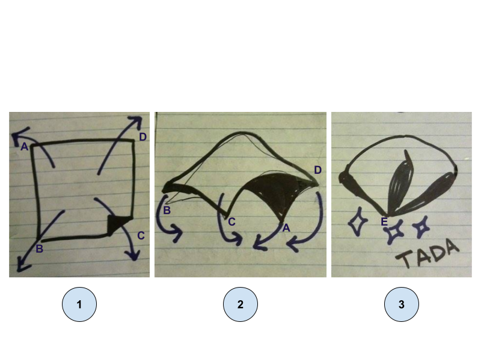
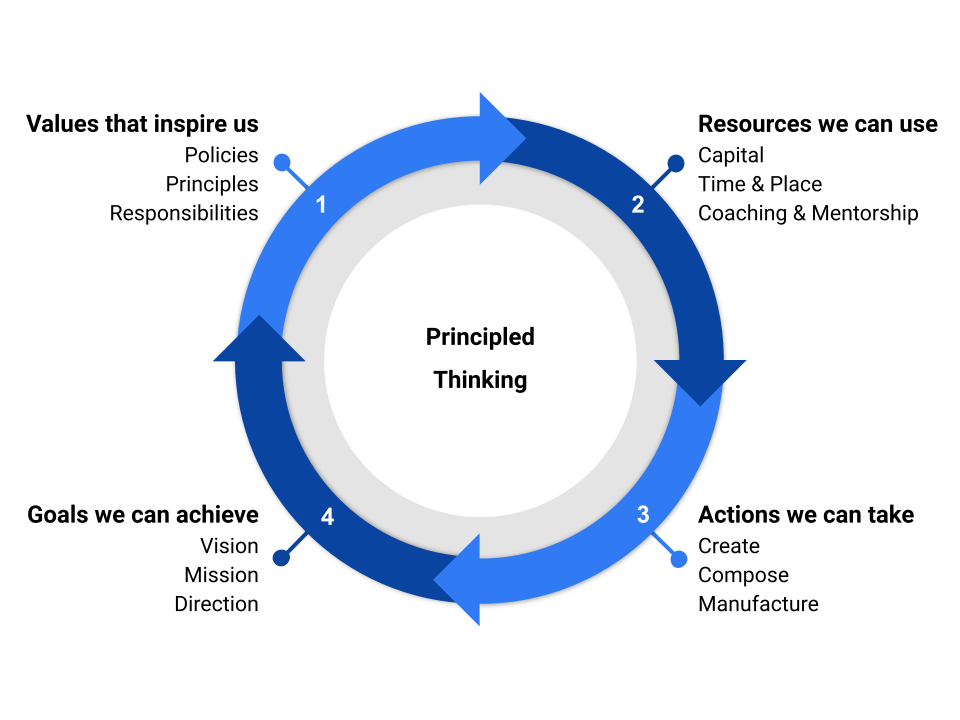

<div align="center">
  
  **[:arrow_left: Previous Section][Prev] | [Table of Contents][TOC] | [Next Section :arrow_right:][Next]**
  
</div>

---

## 1.3 Automated Discovery and Exploitation of Zero-day Faults

For this mathematics and computer science based topic, I will first describe a few definitions, and present an example that introduces the challenges involved in automated detection of human faces within a video. 

The presented example is for giving the reader an idea about the difficulty in automatically "recognizing", any conceivable "concept", in any possible media and ecology, within which an Artificial Intelligence (AI) based system can co-exist and function, along side beings with general intelligence. 

Ultimately, this section aims to describe an automated method for discovering aspects of any given system, that constitute a "fault", and that too a zero-day fault, to subsequently generate automated solutions for patching them by replacing the faulty system with a better, automatically generated architecture; or for exploiting the identified faults, based on morality and ethics of learned commercial, industrial, and military purposes and activities. 

How can building such an advanced AI, not turn into a bane for humanity? Well, we will just have to figure out answers to such concerns using advanced AI that can evaluate itself, other AI, as well as non-AI based systems presented to it, including ones that it finds autonomously because doing all of that manually, is not feasible within one human lifetime of any human being. Would putting more "men" on the job, achieve the required task of answering difficult questions pertaining to AI ethics? Maybe. But how would one find and task sufficiently many people from all walks of life, and genders, to contribute to answering such questions at a publicly accessible platform? 

By the way, if you can identify something within yourself, or in your environment, that is "not a system", then, please do contact me, by submitting a pull request with your educational article or content, regarding the concept of not-system, which can then be added to this repository in a collaborative manner. Or you may join the online discussions here - https://github.com/orgs/callthis/discussions 

**Note:** All contents of public discussions pertaining to the GitHub "Org" named "callthis" are attributed the license of Creative Commons Zero, Version 1.0 (CC0).


<details><summary><h3>1.3.1 Preliminaries</h3></summary> 

Let "point" is a thing such that, it has no further parts, not even a causal factor that generates or justifies its existence. 

The above definition of a point from Euclid's Elements, turns out to be one of the most brilliant axioms that any human being could have ever discovered, because it forms the basis of all geometry, and is an intrinsic part of every aspect of space-time as well as all other gamuts. Such a definition of a point also indicates that it is whole within itself. Furthermore, due to its imperceptible form and infinitesimal nature, it is an abstract mathematical entity. 

One can also assert that infinitely many points exist between any two adjacent points. But, as human beings, we are compelled to use a "dot" to represent a point, when discussing it in the finite context of a tangible medium such as a piece of paper, a chalk board, a cuboid, or an ellipsoid. 

Now, any "collection" of points can be termed as a locus. A straight line is a locus in which the collection of points share a property called linearity. Any line, along which and about which, a "set" of points is distributed, is called a geometrical axis. The number of mutually "orthogonal" axes needed to unambiguously index each point within a generalized "space" indicates the "dimensionality" of that space. The maximum and minimum span that can be measured within a space, respectively define the maximum "size", and the "least count" of mathematical operations that produce a measure within, or from the space being taken into account. 

In mathematical literature about machine learning, the concept of "dimension", of a given matrix, is often confused with the "dimensionality" of the matrix. Also, in literature about machine learning, the number of dimensions in a trained model, usually alludes to the number of "features" obtained via permutations of all the elements available in the training and test datasets. 

So, to avoid confusion, let us instead use the words "size", and ["tensor rank"](https://en.wikipedia.org/wiki/Tensor_(intrinsic_definition)#Tensor_rank), to describe a set of points, elements, data, or items that can be represented as a matrix, whereby: 

- The size of a given matrix is the total number of elements within the matrix. 

- The tensor rank of a given matrix coincides with the total number of ["Eigenvalues"](https://en.wikipedia.org/wiki/Eigenvalues_and_eigenvectors#Calculation) of the dataset described within the matrix. 

</details>

<details><summary><h3>1.3.2 An Example from The Science of Image Processing</h3></summary>

As an example, a trained machine learning model that [detects human faces](https://en.wikipedia.org/wiki/Face_detection) within a RGB-color video, might be described using a matrix that could have a so-called dimension of billions. Billions of what, you ask? That kind of a question only tends to upset some of the machine learning scientists and engineers who build machine learning models, which then causes them to fall into an argument about whether the word dimension of their training algorithm's output matrix alludes to its size, or to its maximum number of columns. A dataset containing a RGB-color video only has elements distributed: 

- along one axis describing the color channel of a pixel; 

    - the integer values on this axis indicate a number corresponding to a color channel, that is, red, green, or blue

- about two more axes for describing the position of a pixel in an image frame 

    - the integer values with respect to these two axes correspond to a coordinate of a pixel, where each pixel is bounded within the size of the image frame, say, 1080x960 pixels 

- along one more axis for the light intensity at a given pixel location indexed by the above three axes 

    - a pixel's intensity is typically an integer value between 0 and 255, for images that use 32 bit data in an image container format, like [JPEG](https://en.wikipedia.org/wiki/JPEG#Typical_use) 

- and along one more axis for describing the time-stamp of each image frame in a video container format, like [MPEG](https://en.wikipedia.org/wiki/Moving_Picture_Experts_Group)

    - this integer value is dependent on the least count of the clock used for timing the video, which could be in milliseconds, resulting in, say, 60000 frames for a one minute video  

So, in the above example, the size of the dataset would be 3x1080x960x256x60000 = 4.7775744e+13 *pixels.* 

To then say that you have a training dataset matrix with approximately 47 billion dimensions would be silly, because regardless of the change in number of video frames, any pixel in the dataset would be unambiguously indexed with only five pieces of knowledge about its location and intensity. As such, the video data would be distributed in a space constructed using five axes, that is, a geometric space having a tensor rank of five. 

A trained machine learning model for face-identification could be a matrix with a very large size, due to a particular permutation of, say, [Haar-like Features](https://en.wikipedia.org/wiki/Haar-like_feature) used for describing a human face to the [Viola-Jones algorithm.](https://en.wikipedia.org/wiki/Viola%E2%80%93Jones_object_detection_framework) However, that trained model or template for face-identification, can use the intensity values of a single color channel, for each two-dimensional video frame. Thus the data in the trained model would instead be described by a space constructed by three axes for pixel locations within an image frame, and one axis for the time-stamp of each image frame in the video stream. 

That trained model or template, can then be iteratively matched with "chunks" or sections of each test image frame, to be able to identify any geometry that resembles a human face. Naturally, the amount of computational resources needed for identifying faces within a live video stream, would be quite expensive.

So, imagine doing the above type of "feature-identification" within live audio and chat data-streams alongside live video data, for building an interactive robot; a robot which can understand as well as interact with the world around it, in a manner that is as intelligent as a college educated adult human being, if not better. Even without haptic and olfactory data channels, merely audio and visual channels expressed as electromagnetic signals to a robot, to make it as "self-actualized" as a college educated adult human being, may seem like a physically impossible or infeasible project. And yet, one needs to remember that something like the products being created by Google or Baidu, already outperform human beings on various well-defined tasks that can be digitized. 

```
Computational resources have become affordable, and the ability to incorporate new developments
into one's own project has continued to become more accessible to technologists.

Here is an example of object detection within a live video stream using Google Coral:

Live Object Detection at 70FPS with low cost hardware - https://youtu.be/T-VjYr7sZC4?t=123 

```

Thus, the process of merely identifying building blocks or factorized components, of a digitized data-stream from "the real world", which resemble labeled items in a training dataset, isn't the required final output of a robotic system that is meant to approach "general intelligence." The algorithmic procedure for making the AI recognize semantic meaning out of a string of features within a data-stream, to then "autonomously" act upon "the knowledge and understanding" obtained from that process, firstly requires a [Large Language Model](https://en.wikipedia.org/wiki/Large_language_model). 

From philosophies of mind and natural language, as taught in Westernized universities, oral or written human speech that makes use of "words" or "symbols", not only conveys pre-formulated and formatted intent of the communicator, it also conveys the "intentionality" that the communicator experiences, during the act of performing activities in-line with the communicator's motives and desires. Said intentionality is supposed to be the "feeling", or human experience, of wanting to continue or to halt an ongoing activity, based on real-time sensory feedback from the communicator's environment. That philosophical approach to describing linguistics and cognition is drastically limited. So, let us generalize the idea of "language" from its gestural, or behavioral form, to a cascade of synchronous as well as asynchronous articulations that can provide "signals" from a sender to a receiver, via the physical process of "communication." 

>The most basic definition of physical communication is: "transfer of 'information' from one system to another via signal transmissions, energy transduction, or changes in momentum or electromagnetic states of the interacting systems via 'contact', at any possible span of short or long distances in space-time." 

At least, that is how I like to define physical communication. And, changes in momentum or electromagnetic states necessarily entail thermodynamic changes among interacting systems, that are causal, and aren't merely coincidental. 

What then is a system, and how are system boundaries or interfaces defined? Well, only "nothingness" is not a system, and the chore of identifying dynamically evolving boundaries of a system, requires the use of ["Ontological Methods in Systems Engineering."](https://github.com/callthis/status-quo/blob/main/docs/01-02-07.md#1271-ontological-methods-in-systems-engineering)

So, let us construct a topological space that describes the mathematical relationships between all conceivable concepts, with those concepts being distributed upon the constructed topology, including the concept of a concept, the concept of recursion, and even the concept of what a topology can be in terms of a mathematical object of study. In doing so, we will build an algorithmically generated "semantic model", instead of a "language model." The semantic model could then be utilized for tasks like discovering and studying mathematical theorems, that have yet to be recognized using human efforts without the aid of generative-AI based analytical engines.  

<br>

As shown in the following diagram, ***Line AB*** represents the axis defined as "the part-whole continuum", and ***Line AD*** represents the axis defined as "the abstract-tangible continuum." The 2-Dimensional ***Area ABCD,*** represents a gamut of concepts known as an ["abstraction hierarchy."](https://github.com/my-realm/oc/blob/master/doc/ah.md#history-of-abstraction-hierarchy) Each point on this gamut is indexed as the coordinate of an individuated concept, such that each of those concepts are comprehensible to human beings. The semantic meaning ascribed to each concept on the gamut, can thus, only be relatively abstract-or-tangible with respect to a subjective observer; and is simultaneously, either a component or an ensemble, in relationship to other concepts located on the gamut, using the objective basis of "set theory." 

This 2-Dimensional gamut of concepts can then be converted into a 3-Dimensional model, by introducing an axis that represents the continuum of "depth-feature versus surface-feature." 

So, to make the corners of the 2-Dimensional ***Area ABCD*** touch at a single ***Point E,*** "fold" the area as shown in the following diagram, to create a 3-Dimensional volume that represents, "a semantic space."[^1]  

<p align="center">
    </img>
    <br>
    <b>Converting the 2-D model of an "abstraction hierarchy" into a 3-D model of a "semantic space."</b> 
</p>
<br>

In the newly obtained 3-D model of a semantic space: 

- Depth-feature is a thing, or a concept, that is closer to the sub-atomic description of reality in terms of physical space-time measured in spans of [Natural Units](https://en.wikipedia.org/wiki/Natural_units) (such as but not limited to: [Planck units](https://en.wikipedia.org/wiki/Planck_units), [Stoney Units](https://en.wikipedia.org/wiki/Stoney_units), and [Fine-Structure Constant](https://en.wikipedia.org/wiki/Fine-structure_constant)), in comparison to the macro-level, biological shape and size of human beings. 

- Surface-feature is a concept, or a thing, that is more readily accessible to unaided human biological sensory organs, and thus to human cognitive faculties, without the aid of technological instruments, or tools and gauges. 

- And the topic of abstract-versus-tangible can be made more objectively measurable, by comparing all given concepts, including things like "time", or "chair", with the most abstract concept called "point." Let the origin of the new 3-Dimensional coordinate system containing the model of a semantic space, coincide with the **Point E.** The origin of the coordinate system is also supposed to represent the location of the geometrical concept of "a point." All other concept placed on the 3-Dimensional topology are to be measured at a distance with respect to the origin using vector algebra. How to do so will be made clear in the subsequent sub-sections. 

---

<details><summary>By the way,</summary> don't try comparing things to God, either via similarity or via contrast, because all forms of comparison of a conceivable thing with God, results in that created thing ultimately becoming, annihilated.</details> 

---

Anchoring concepts to locations on a 3-Dimensional topology called the semantic space, using a regularized arrangement that can be codified, highlights causal relationships due to which, causality is directed from a relatively abstract depth-feature to a relatively tangible surface-feature. Subsequently, any feedback loops that can exist in a vectored manner, directed from a relatively tangible surface-feature to a seemingly abstract depth-feature, can also be discovered via the encoding method that is described in the next sub-section of this article. Therefore, causality exists within ecological feedback loops, and isn't something that is somehow directed strictly from "the human mind", onto "the material world." 

So, one must first ask themselves, are there any combinatorial arrangements of physically measurable quantities of the universe we exist in, that are capable of accurately and precisely describing concepts like personhood, cognition, intelligence, awareness, spirituality, attention, willingness, wellness, aesthetics, morality, ethics, veridicality, legality, meaningfulness, or contentment? 

Also, do people need to define concepts like mind, or a soul, the way the concepts of point, or the average [speed of light](https://en.wikipedia.org/wiki/Speed_of_light) between two points within "isotropic" "free space" have been defined, in order to be able to express themselves as mere human beings; or to be able to construct scientific tools and equipment for experiencing a better quality of life, while utilizing other well-defined concepts via arts as well as engineering and managerial sciences? 

Most importantly, what kinds of concepts are yet to be properly defined or even discovered, that would otherwise make existence more sensible and worthwhile, for human beings as well as other living species?  

</details>


<details><summary><h3>1.3.3 Intuitive Method of Constructing a Semantic Model of a Given System</h3></summary> 

We can take a look at an intuitive form of the pseudo-code for creating a machine-readable model of a semantic space, using the following diagram labeled as "Principled Thinking."  

<br>
<p align="center">
    </img>
    <br>
    <h4 align="center">Principled Thinking</h4> 
</p>
<br>

The above diagram may better explain the process of discovering "blind-spots" and "misconceptions" within any system's design, for persons who are less inclined to using an algorithmic description of how to construct a machine-readable semantic space. The diagram depicts four stages of analyzing any given system, in which each stage must be in concordance with the adjacent stages. 

- To begin the analysis of, say, an existing grocery store, the analyst would start at Stage 1, concerning the store owners' ethos and cultural values. The reason for owning and operating a grocery store would be derived from the cultural values and needs formally stated by the store's stakeholders. The roles and responsibilities that the company's employees are expected to perform, as well as the standards of customer satisfaction and yearly profits they are to aim for, are contingent on the cultural values that company members can adhere to. If concepts like "honesty", "customer satisfaction", "employee code of conduct", "facility's cleanliness", "handicap parking and accessibility", "building's architectural appeal", "product visibility", or "safety" weren't a primary concern, then the analyst would be able to identify such deficiencies before moving onto the next stage. Stage 1, provides answers to questions starting with a "why." For example, "Why is a security system needed in a grocery store?"

- Stage 2, of the store's analysis would identify the financial and physical resources available that match the principles and policies of the store's proprietors. In this stage the analyst can identify underutilized assets as well as shortages within required resources that need to at least, meet the value system and sense of aesthetics subscribed to by the company's stakeholders. Stage 2, provides answers to questions starting with a "what" or a "which." For example, "What kind of a neighborhood is the store located in? Which type of financial, physical, and digital security measures are available or needed, to maintain desired level of operational safety and 'peace of mind'?" 

- Stage 3, of the analysis provides answers to questions beginning with a "how." For example, "How is a particular version of financial, physical, and digital security system to be implemented, with the necessary administration of employee training and corporate policies?" This stage of analysis, conjoined with the previous stages, would highlight key areas of strengths and weaknesses in the day-to-day managerial operations of the grocery store. Any new polices that need to be created, and any physical resources that need to be reallocated or additionally acquired, are to be clearly identifiable during this stage. This is also the stage where business operators would be able to analyze and ratify, human resource policies, inventory management schedules, advertising campaigns, salaries and wages, product pricing strategies, and investor relationships, to arrive at statements about sales and profit goals. 

- Stage 4, which is an abstract-whole, turns out to be a natural outcome of the previous stages of "thinking and making", whereby the company's goals become defined in "achievable and realistic" terms. Any envisioned goals without taking stock of available skills and resources along with a proper grounding within the company's espoused cultural values, would most likely turn into a pipe-dream. Coming up with fancy goals and mission statements that possibly cannot be achieved within the constraints of available ground truths, can thus be avoided. Ultimately, Stage 4 of the analysis, must be in accord with the axiomatic principles identified at the very onset of the business analysis. 

You may thus note that, Stage 1 of the analysis identifies *abstract-parts* of a given system. These abstract-parts are the principles, norms, and needs, that constrain or bound the system within an ecology, in an axiomatic or "legally" defined way. Stage 2 of the analysis describes a set of *tangible-parts* of the system, pertaining to existing materials and processes that can be utilized as per known constraints. Then, Stage 3 produces a set of performance indices and designs in the form a *tangible-whole,* which describes how certain kinematic and dynamic relationships can be connected or built, to arrive at viable goals using the concordance between Stages 1 and 2. 

The eventual Stage 4, reifies the outputs of the system in a descriptive manner, by showcasing its qualities in comparison to the ecological constraints identified in Stage 1, rather than a normative objective that ought to have been achieved irrespective of ecological truths and realities. In this way, the ideas of economic efficiency and feasibility are directly baked into every possible approach to arriving at a goal, as long as Stages 1, 2, and 3, are in concordance with each other. Stage 4, represents the constructed or realized, *abstract-whole.*

However, when a need for doing "free-form" designs or research, in an exploratory manner, is asserted during Stage 1 of building or operating a new system, the desire to be spontaneous, novel, and innovative can produce "unexpected" results. As such, if additional constraints are identified via Stages 2 and 3, the eventual results can at least be safe and sound, while limiting wastage and potential harms from exploratory research and development (R&D) endeavors. 

This is why, mature companies tend to allow nascent startup founders to eagerly take risks of being spontaneous, artistic, and innovative, so that large corporations can eventually learn from the mistakes of startups, or simply buy out a surviving new enterprise that develops a competent business model with a legitimate value proposition. A startup that intends to outmatch mature competitors, would need to be able to continuously evaluate its capacity to do so, while growing its market capitalization via its R&D and business operations.  

More importantly, it can be observed that: 

>The premeditated moral consideration to prioritize exploratory and hazardous risk taking behaviors while prospecting for any types of advantages or gains, above the safety and well-being of bystanders and consumers, or above societal concerns for environmental sustainability, is an engineering and managerial decision that is often hidden by wrongdoers, using glossy marketing materials and cleverly worded "legal disclaimers." 

Wrongdoers may even try to evade responsibility for their untoward and careless actions taken during R&D cycles, by claiming that the process of producing and operating a desired system, can be "too pedantic," if it is conducted by using formal methods of simulation and modeling. 

Identifying those types of harmful behaviors of a company's leadership and management, that are erroneous, destructive, predatory, parasitic, debilitating, or injurious in any significant manner to any persons or groups, or to any forms of natural heritage that do not exclusively belong to prospectors, requires such principled analyses. The rational and rightful measures, which can then be taken up by prosecutors against offending parties to penalize them, and also to deter further harms that are being or can be committed by other groups of prospectors, can thus be correctly legislated via the analytical and scientific methods demonstrated by Principled Thinking. 

Even more importantly, the concepts of "acceptable collateral damage" and "casualties of warfare", can be defined in a pragmatic and correct way by "patriotic entities" using Principled Thinking, in the context of authorized military, para-military, or policing activities, while growing or maintaining their "sphere of influence."[^2]

</details>


<details><summary><h3>1.3.4 Method for Generating a Machine-readable Semantic Model</h3></summary>  

<h4><ins>Step 1: Gathering building blocks of a graph</ins></h4>

The first thing we will need is a dataset of words, which is typically a [corpus](https://en.wikipedia.org/wiki/Text_corpus) in the form of a data type known as "dictionary", or a set of corpora such as books and articles found in [ArXiv](https://info.arxiv.org/about/index.html), or [Gutenberg Project](https://www.gutenberg.org/), or [Wikimedia](https://meta.wikimedia.org/wiki/Our_projects). 

Scraping websites to build corpus based large language models (LLMs) is an expensive chore, but it might be a necessary task when creating a corpus of text for non-English languages and other commercial applications of LLMs. 

- An example for creating a corpus in Mandarin language by scraping different websites for Named Entity Extraction, Event Extraction, and Relation Extraction during production of LLMs and "Knowledge Graphs", is provided here - https://github.com/zjunlp/KnowLM 

- Another example for quickly translating a word in a file or a web browser is showcased here - https://github.com/filimo/ReaderTranslator#readme 

- And here is an example of working with multiple language corpora including math symbols - https://github.com/SUSYUSTC/MathTranslate 

For our purposes, let us start by using an English dictionary, from either one of the following options:

- The version of "Webster's Unabridged Dictionary" of English Language, available form Gutenberg Project in UTF-8 format - https://www.gutenberg.org/ebooks/29765   

- The "english Dictionary.csv" file from the repository - https://github.com/benjihillard/English-Dictionary-Database 

- The .txt or .json files containing "set of English words" without definitions - https://github.com/dwyl/english-words 

- And here is a smart approach for creating an "open dictionary" compatible with REST API format - https://github.com/open-dictionary/english-dictionary/ 

Additional elementary tokens of English language such as punctuation can be obtained from the given git repository, which also has a collection of popular symbols along with alphabets and notations used in other languages - https://github.com/symbl-cc/symbl-data

It would be worthwhile to make sure that each word and irreducible token within the "set of English words", has an entry within the dictionary that is to be used in the subsequent steps. Additionally, one can find items within a given dictionary, which aren't contained within the flattened set of "unique" words, to then add that word to the flattened set, for future use in creating a mathematical graph of words. 

<b>Notes:</b> 

1. Computing languages like Python and Julia have convenient, builtin functions like `set`, `dict`, and `map` to efficiently do the above-mentioned comparisons between `lists` of items. 

2. While building an LLM from a corpus, one can use a "tokenizer" to first create a list, or a sorted list, or a flattened set of unique words found in the corpus. Doing that also builds a ["concordance"](https://en.wikipedia.org/wiki/Concordance_(publishing)) of the corpus. Here is a good resource for different types of tokenizers - https://huggingface.co/docs/transformers/main_classes/tokenizer 


<details><summary><h4><ins>Step 2: Clearing up philosophical issues</ins></h4></summary>

If you were to look up the meaning of the concept of a "word" in a regular English dictionary, it would explain that entry with words, just the same way it explains all possible entries in itself, with words. Also, the definition of a "word" in regular English dictionaries happen to use the concepts of a "concept" and an "idea." Now, just for fun, also look up the definition of "dictionary", within a regular English dictionary. 

The above exercise or thought experiment, is for the sake of understanding that human beings do tend to understand the meaning of words like, "words", "concepts", "constructs", "relationships", "edges", "nodes", "graphs", "sets", "items", "things", "containers", "systems", and "a dictionary" through physical interactions with a sociological and technological environment. 

A socio-technical environment is a synonym for "human ecology", which emphasizes the collaborative nature of human development and evolution through social interactions within a community that is constantly mediated by various human made tools and technologies apart from natural structures found in the universe. For the sake of this overall exercise in building a model of a "semantic space", let us assert that various structures already found in nature, such as water, earth, sky, air, fire, living creatures, etc. are easily accessible to all human beings as soon as a human is born into this universe as an infant. Infants need not learn how to use a regular dictionary of any conceivable language to merely start living and learning from a socio-technical environment. 

Moreover, any human being at infancy, isn't a "blank slate." We know that now, and we know better at this point in history compared to earlier philosophers, due to our knowledge about how information is encoded within biological building blocks of living organisms such as chromosomes, because of which, a new born infant is already in possession of various types of "innate", "intrinsic", and "inherent" knowledge. That knowledge is indeed necessary for bodily functions that allow the infant to bump into things and start interacting with a socio-technical environment while fulfilling biological functions to sustain life. 

Too often, in literature concerning psychology or physiology, the idea of *"sensation"* is used for describing the process by which physical data from a socio-technical environment is translated as a signal or "a stimulus", into reactions by human sensory organs at a tissue level within microsecond duration. Subsequently, the interpretation of that reaction during a short period of time at the level of seconds, to produce some type of a "mental model", along with a gain of knowledge, at least at a basic level of understanding of "reality" due to the stimulus, is called *"perception."* Following the processes of sensation and perception, a more complex process by which a human being takes those sensations and perceptions to generate inferences via different types of reasoning, along with additional knowledge available to the person via their memory, is called *"cognition."* This is how, previous generations of researchers, especially Anglo-Saxon and westernized ones, have tried to distinguish sensation, perception, and cognition as a sequence of processes, wherein, the ability to perform "advanced" cognitive tasks, improves with biological development and socio-technical experiences involving "education." 

The main challenge with the above-mentioned approach to psychology and sociology has been the inability to arrive at sensations, perceptions, and cognitive decisions or judgments about the concept of "mind", which different groups of people can readily agree upon and utilize in political science, medical sciences, linguistics, religion, and other fields of study that are dependent on findings from psychology and physiology. Of course, psychology and physiology within themselves can be acknowledged as being dependent on physics, chemistry, biology and various mathematical constraints of geometry to discovering knowledge. 

One might even ponder, are all of physical sciences and mathematics, including everything pertaining to human beings and the rest of the universe, contingent on a super-natural deity such as God? If one were to either say that [gnosis](https://en.wikipedia.org/wiki/Gnosis) is only possible via some type of [praxis](https://en.wikipedia.org/wiki/Praxis_(process)), or that gnosis is even possible via innate knowledge without any type of praxis, rituals, practices, and apologetics(https://en.wikipedia.org/wiki/Apologetics), then, in both cases, their worldview might not be irrational, inane, insane, crazy, deluded, or deranged in any sense of the words: irrational, inane, insane, crazy, deluded, and derange. Comparatively, even the worldviews from atheism aren't somehow scientific or more rational than religious concepts. More importantly, the purpose of constructing a semantic space, is to be able to parse every manner of conception, regardless of its abstractness or materialistic tangibleness.   

One must also be aware and note that, ascribing derogatory or debasing words to persons who have a different perspective or a worldview, is usually done by those who have an agenda of asserting their worldview as being superior and more legitimate than all the ones they disagree with. This type of crass and obscene tactic typically involves attempting to hurl insults, injuries and destructive attacks upon other persons who have different worldviews, for obtaining or maintaining socio-political power.   

Therefore, the archaic approach to describing the physical world around us, and our human faculties in comprehending the world, via philosophical ideas like ["tabula rasa"](https://en.wikipedia.org/wiki/Tabula_rasa), is inefficient for deciding what counts as ontic versus epistemic. Worst of all, the use of ideas like "children are a blank slate", have too often been used for justifying abductions of children during cultural genocides, for the purposes of indoctrinating those children and forcibly assimilating them into a community that is different from their original ethnic and cultural background. Puritanical fiends have tried to justify genocides of indigenous cultures by claiming that forced internment and indoctrination did not do any harm or cause any pain, even while cunningly or forcibly wiping out the personality traits and cultural outlook of captive children and young individuals, in the name of providing 'superior education and development' to the snared persons. Those fiends and insidious wrongdoers have continued to make those types of claims on the assumption that at the time of being interned or indoctrinated, the children and young individuals were practically a blank slate due to which, they could not have been harmed or injured in any way. 

So, instead of using ideas that have been a main ingredient of cruelty inflicted upon indigenous populations and peoples of color, we can simply decide and assert that all forms of signal processing accomplished by any system is defined as "computation." And thereby, *human cognition in its psychological form* with personality traits, and emotions and thoughts, happens to be due to a cascade of computations performed by biological components of the human body. Concurrently, *human cognition in its sociological form,* which impacts emotions and thoughts, and which can cause evolutionary development of personality traits as well as behavioral outlook, through "linguistic exchanges or interactions" and "groups based decision making", happens to be a series of concordant computations performed by a network of people, in a socio-technical environment. 

Additionally, for the sake of this discussion, we will avoid the definition of "memory" in common English vernacular, and instead use the assertion that *"memory"* exists, by virtue of adjacency of things. Therefore, the adjacency of atoms is a type of memory at a given instance of spacetime, and so is the adjacency between two trees or two cars in any part of the world, irrespective of the distances between them, aside from the adjacency between the distance-wise permutation of people and planets. In fact, even the permutation of letters, gaps, and colors in this write up, is a type of memory. Indeed, all portions of the universe constitute a memory, at each instance of spacetime, but not from an ego-centric or an anthropocentric perspective. Here, the technical concept of memory is being defined as a fundamental physical phenomenon that exists due to any form of adjacency, between things that already exist in the universe. Let me repeat this for emphasis: Here, it is being asserted that any configuration arising from any collection of things within spacetime, is memory. 

So now, we can completely do away with philosophies involving "tabula rasa" of human mind at infancy or youth, by suggesting that there already exists an evolutionary process involving cascades of computation, across and throughout spacetime, irrespective of the existence of humans or human cognition. 

The existence of cascades of computation, across and throughout the universe at every span of its structural and functional organization, is empirically verifiable. It must be noted that concepts like "recorded history" and "archaeology", cannot be defined without such a contiguous and continuous evolutionary process of computations across spacetime that "communicate" or "transfer information", from one part of the universe to another. So, if no portion of the universe is "blank" and devoid of information (as well as information transfer), then likewise, no organism or a system within the universe as its portion, is devoid of information and pre-processed knowledge. 

That universal process involving the exchange of information via physical transformations and transmissions, of energy and matter, throughout all of spacetime measured in eons over intergalactic distances, has existed prior to the ["Holocene era"](https://en.wikipedia.org/wiki/Holocene_calendar#Conversion), and is going to continue to exist even after the destruction of the solar system in billions of Earth-years from now. Of course, such a non-egocentric idea is simply untrue or false, for those who believe that the universe along with all of its trappings comes into existence when they are born, and goes out of existence when they die. People who believe in that type of a purely ego-centric notion of cosmology, which is limited to their individual lifespan, also aren't deranged or "mentally damaged", because a thing known as "death" would need to be incorporated as an input condition, for any kind of empirical verification of different worldviews involving [eschatology](https://en.wikipedia.org/wiki/Eschatology).  

Perhaps, the most difficult concept to include within a semantic space, is that of "faith" and "devotion." 

I will attempt to individuate them none the less, by stating that faith is an extrapolation of "trust" in an entity or an event, whereby the entity or the event one has faith in, is "divine", or "supernatural." The ideas of divine and supernatural, in turn, require a person to admit that things unconstrained by physical laws of nature do exist, or can exist, within a realm that is outside the bounds of physical universe, or at least outside the bounds of known scientific knowledge. How or why those divine or supernatural things are able to impact natural entities and events within the bounds of a physical universe that supposedly isn't divine in the least bit, requires a whole lot of imagination and at least one mythological narrative. 

It is indeed easier for some people to decide that the natural universe is divine, at an infinitesimal level of its structure and function. Such an idea alludes to the "imminence" of divinity as an integral part of each being within the universe. There is also the idea that divinity is ever present and abounds every portion of the universe, but is merely more complicated and tedious to comprehend than quantum mechanics and the square root of minus one. Most people, can do very well in life, never dealing with quantum physics and complex numbers, so, similarly, religious topics about what is or isn't sacred, might also elude people, without those people suffering any socio-economic losses. 

Thereafter, if one understands the increasing level of attention and effort that goes into being "interested", "committed", and "dedicated" to something or someone, then they will be able to understand that devotion is the next logical level in the progressive scale of: interest, commitment, and dedication. 

One might even ask, can a human being possibly obtain and retain any precepts consciously, with zero level of attention and interest invested into obtaining and then retaining said precepts? 

So, how much imagination and commitment must be applied when doing something? Where must a precept from a mythological narrative be referenced? And when must certain types of concepts be alluded to in a conversation or a publication? Well, answers to all such questions depend on the socio-political context of a person's existing situation and their capabilities in articulating themselves. 

If you, as a mere person living in this world, happen to utter certain topics out-loud (or publish them in a publicly available media), which then somehow causes you to get attacked overtly or covertly, or immediately, or perniciously by particular groups of people, then, hopefully you knew how to defend yourself from those kinds of attacks and attackers before doing your chosen sets of activities. However, just in case, you committed certain activities unknowingly, without deliberation, without properly evaluating the consequences of your actions, or without appropriate anticipation of future outcomes of your deeds, then hopefully, you will gain an opportunity to learn from your experiences to do things differently thereon, upon withstanding the consequences of your actions. The same hope, may also be recognized in withstanding consequences generated from other people's actions, and also from those generated by non-human phenomena in nature, all of which, might not have had any pertinence to your existence before those consequences impinged upon you life and belongings. 

What then, does the concept of "hope" actually mean? Is it mere an expectation about a future possibility? Based on what? Based on lack of accurate information and precise knowledge, you say? 

Then faith, as well as trust, are practically an extension of that hope and reliance on potential outcomes in situations involving greater levels of uncertainty, a level much greater than the type of uncertainty that could have caused you to experience a sense of hope or reliance at any point during your mortal lifespan. 

Now, would you like to say that "uncertainty" isn't an ontic thing pertaining to every portion of the physical universe we exist in? 

"Entropy" by the way, is a measure of uncertainty within a region of the physical universe due to a particular rate of information transfer between that region of spacetime and an "observer" coupled to it. So, after defining "measurability", measure space, flux, and an observer's capacity to observe as well as record things, we can conveniently explain entropy and how "entropic" the universe is, at a given location of spacetime. 

If you thought that religion, physical sciences, mathematics, languages, medicine, sports, economics, or socio-politics were difficult to comprehend and practice, then you merely needed to learn a few simple strategies for acquiring basic building blocks of knowledge and understanding, to ease your burdens, so that you may face all other things in a suitable manner; things which could come your way in this life, or in the hereafter.

</details> 

<h4><ins>Step 3: Building a generic graph of concepts</ins></h4>

![]

</details>


<details><summary><h3>1.3.5 Proposed Applications of Semantic Models</h3></summary>

Concepts like artificial intelligence, strong artificial intelligence (AI) and general intelligence (GI) are frequently used in fields of humanities, business, engineering, and sciences. The definitions of, and differences among concepts like strong AI and GI are debatable. To aid current cybernetic researchers, the proposed schema of a machine-readable semantic model can accommodate knowable concepts, and compare all forms of "intelligent agents." An intelligent agent may be a machine, a living being, a combination of such entities or even a collection of such combinations. In this manner, information processing capabilities between agents can be compared for the sake of systems design and efficient work allocation among agents.

</details>

[^1]: This drawing from 27th December, 2015, was made by my ex-wife who was also my best friend. She was the only person to immediately understand the model of a semantic space, that I had tried to explain to her using mere words. I wouldn't have been able to write about this topic, without her drawing illustrating the method to obtain a 3-D model of a semantic space, from a 2-D model of an abstraction hierarchy. In the year 2020, the relationship I had with my best friend and life partner was destroyed by Canadian operatives who defiled our home. Canada has yet to apologize and make amends for the devastating wrongdoings of its agencies, which caused our lives to be torn apart. Worse, such ruinous harms have continued to be inflicted by Canada's state-sponsored agents and contractors upon targeted groups and individuals, because of xenophobia, Islamophobia, racism, and discriminatory prejudices that are endemic to the organizational culture of key institutes in Canada. 

[^2]: I am going to guess that various agents and agencies from Canada will eventually try to claim that the lives of my family and I, similar to those of many others, were 'acceptable collateral damage', as per the designs and agenda of Canadian national security and secrecy. The unresolved conflict, isn't with their post-hoc patriotism, it is with their ongoing, premeditated, coordinated, bad-faith behaviors borne out of their long-standing hypocrisy, conceit, ignorance, bigotry, racist ideologies, and Islamophobic world views; all of which, happen to be nefarious and insidious! So, it is naturally the responsibility and duty of other conscientious agents and agencies, including those from Canada, to immediately rectify and deter those types of bigoted bad-faith behaviors, with proper remedies and punitive damages awarded to survivors and victims. 