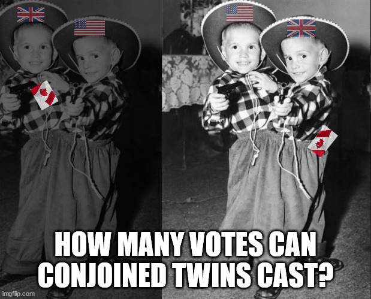

# Canadian Sovereignty, Question Mark

Doubts about Canada's autonomy and [sovereignty](https://en.wikipedia.org/wiki/Sovereignty) as an independent, self-governing state can be raised because of continued subservience of the Canadian Parliament, under Britain's monarchy. 

It is a known fact that Canada's Prime Minister is still, merely the first minister of the British monarchy within the dominion of "Commonwealth" territories known as Canada. To which self-governing body of people do those territories labeled as Canada belong to? Do they belong to the British? Do they belong to the citizens and residents of Canada who needed approbations from an act of the British Parliament, to be recognized as such? 

One may argue that Canadian Parliament's fealty to British monarchs and to the heirs of those feudalistic warmongers, does not necessarily undermine its credibility and autonomy as an independent nation-state. Canada is indeed a ratified self-governing country isn't it? Canada has a federal government, it can issue passports and visas, it has armed forces and various other agencies that protect its national borders, and Canada also has a standing in G7 (G6), and G20 meetings. 

However, are Canada's national and foreign policies truly made autonomously, and independently by Canadian legislators, without those legislators regularly caving under pressures from the US and the UK? Are its shipping and logistics industries independent of the hold that the US has over the globe's North-Western hemisphere? For instance, isn't Canada's dairy and agriculture industry deliberately made to fall prey to unfair American trade policies? And are Canada's actuaries as well as telecommunications corporations, sufficiently independent from American stakeholders? Don't those American stakeholders usually tend to prioritize their personal interests while continuously pillaging and pilfering Canada's economy? Such acts of looting by predatory capitalists have continued to cause increasing harms and damages to Canadian business owners. The most detrimental effects of those predatory business practices adopted by American and British corporate entities, are evident in the decay of Canadian consumer rights as well as privacy rights. 

Furthermore, in view of the concerns highlighted in this article, is Canada's currency (CAD) capable of being freely and openly traded in international markets, without protectionism offered to CAD's foreign exchange value and parity, by American Federal Reserves via US chartered banks and American brokerages? 

Essentially, Canada is a client state, or a protectorate, or a vassal state of the US and the UK. Moreover, the US and the UK like to call Canada their protege state, whereby Canada is being proudly groomed in the stables of Western Neo-liberalism. So what's wrong with that? The problem is that Canada is being kept and groomed by America and Britain, the way under-aged girls were being kept and groomed by Epstein and Maxwell. 

## Canadian Lobbyists and Information Brokers 

>If the kinds of issues highlighted in this article, about Canada's autonomy and capacity for self-governance have always been raised through formal and informal channels, then what basis did Canada ever have in making repeated bids for a seat on the United Nations (UN) Security Council?

The Trudeau Regime's bid for a seat on the UN Security Council, during the years 2016 to 2020, was conducted through expensive lobbying and marketing that coincided with Justin Trudeau's run up to Canada's general elections. It is plainly evident that those activities were part of an inglorious ploy to have Trudeau occupy the airwaves and the lime-lite, particularly during the [42nd General Elections season in 2019](https://en.wikipedia.org/wiki/2019_Canadian_federal_election), by ginning up the Canadian government's bid for a seat in the UN Security Council as a way to mask the faults within Canada's public governance structures. Millions of tax-dollars were spent by the Canadian government for its clumsy attempts at portraying itself as a legitimate contender, for a UN Security Council seat. Moreover, the bid was only open for a "temporary seat" at the UN security Council. 

Couldn't the same tax-dollars, instead have been spent on improving Canada's healthcare and public infrastructure systems? Did Canada have its priorities set correctly, when it disingenuously approached lobbyists and "information brokers" to cajole support from various foreign nations for influencing votes in the UN? Weren't Canadian operatives also trying to illegitimately influence "the hearts and minds" of ordinary residents like me in Canada, to take undue advantage of our openness and trust?  

I can now relate a few details about lobbying activities conducted by certain Canadian groups, in 2019. At one particular meeting during a casual dinner at a Kitchener-Waterloo socialite's house, a Canadian lobbyist spoke about Canada's coming of age, and its rightful place in the international stage as a champion of human rights, civil liberties, and of democratic values. The speaker opined that such values championed by Canada could be exported to other countries like Pakistan, India, and Bangladesh. I then realized that I was only invited to that dinner party, out of the blue, merely for my ties and business connections in Southern Asia. 

When it was pointed out to the particular lobbyist via subsequent discussions that Canada's track record in maintaining human rights for indigenous and First Nations peoples, has remained abysmal, and that the numerous issues related to genocides committed by Canadian state-sponsored agencies have yet to be resolved, the person spoke up and said, "Those things are being worked upon. After all, Rome wasn't built in a day." 

So it was pointed out to him that, "Rome was burnt and razed to the ground, overnight, by a Nero." 

There have been an increasing number of home-grown Neros in the form of right-wing white-supremacists within North America, who have taken root in Canadian public institutions and private organizations. The manner in which those supremacists and racists have been consolidating their power in North America, and have started to more strongly spread their deleterious ideologies, through various media, about their supreme right to global dominance, happens to be a serious and growing problem for all communities throughout the world. 

## Open and Free Public Discussions

As you can see, for a long time it has been observed by most members of the UN Security, and the UN General Council that, Canada conveniently scoots over to the adult's table, by hitching a ride on Britain's coat-tail. It is also well-known that Canada often gets used, misused, and abused as a sock-puppet, by the US, during formal meetings of various constituted bodies of the UN. 

So, there obviously wasn't going to be a unanimously agreed upon way to allow Canada into the UN Security Council, just so that the US and the UK could keep [astroturfing](https://en.wikipedia.org/wiki/Astroturfing) the UN Security and General Council meetings, through their puppeteering of Canadian delegates. 

Sometimes, in matters of international importance and global significance, the US and the UK hold Canada for ransom, and at other times, as a human shield because at all times, they conveniently have Canada in their back pocket. 

 

    </img>
     
    <b>US, UK, and Canadaaaa</b>
     

In view of failing infrastructure for public transportation, judiciary, healthcare, and education available to Canada's denizens, can Canadian authorities ever ascend to the standards and expectations of Euro-Zone Economies? No! Canada absolutely cannot meet the standards of the European Union (EU), especially in matters concerning environmental protection, housing, healthcare, justice, and equitable socio-political opportunities for all ethnic communities residing in Canada. 

So, the question must be asked again: what business does Canada have in continuously chasing after lobbyists and even common business persons like myself, using formal as well as informal meetings, to keep promoting itself as a vanguard of global security and peace? Canada's duplicity and hypocrisy in maintaining basic human rights and civil liberties for its citizens, residents, and for its foreign visitors is starkly and undeniably visible, to the entire world. 

Denying or deflecting issues pertaining to Canada's ongoing human rights violations, genocides, environmental degradation, systematic political abuse of medicine and public services against freethinkers or dissidents, perilous and pernicious activities conducted against differently abled people and marginalized communities, as well as the rising cases of murders of ethnic minorities due to endemic xenophobia in Canada — only makes Canada's passive-aggressive defense of its duplicitous position and values, appear even more ignoble and disgraceful. 

Now, given that Canada is in favor of "open and frank public discussions of various issues," does this editorial article seem open and candid enough for you? 

### Additional news reports 

Here are a few publicly available news reports, about Canada's failed attempts at gaining a seat on the UN Security Council:

1. https://www.theguardian.com/world/2020/jun/18/canada-loses-bid-un-security-council-seat-justin-trudeau

1. https://www.cbc.ca/news/politics/united-nations-security-council-canada-1.5615488
         

— End of File —
