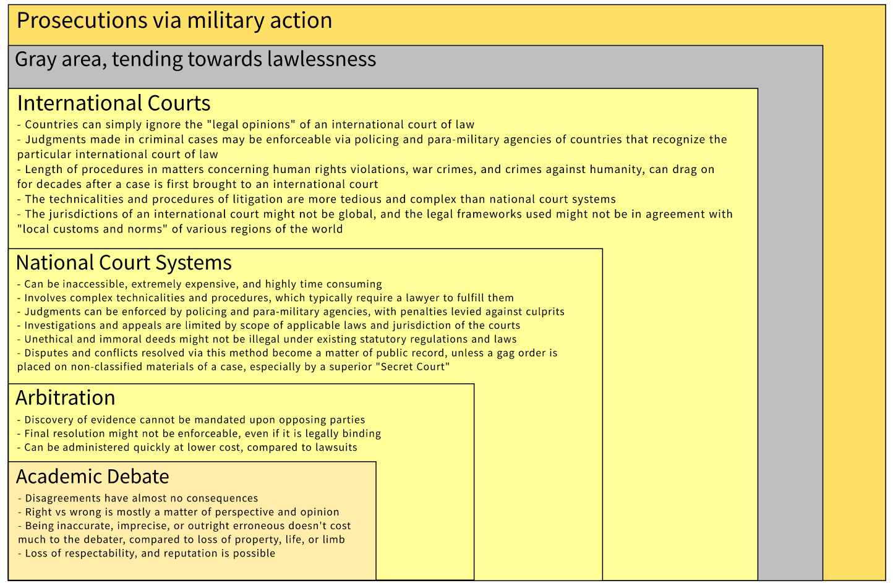

## Available Legal Avenues 

- **Prosecutions via military action**

- **Gray area, tending towards lawlessness**

- **International Courts**
    - Countries can simply ignore the "legal opinions" of an international court of law  
    - Judgments made in criminal cases may be enforceable via policing and para-military agencies of countries that recognize the particular international court of law
    - Length of procedures in matters concerning human rights violations, war crimes, and crimes against humanity, can drag on for decades after a case is first brought to the court 
    - The technicalities and procedures of litigation are more tedious and complex than national court systems 
    - The jurisdictions of an international court might not be global, and the legal frameworks used might not be in agreement with "local customs and norms" of various regions of the world 

- **National Court Systems**
    - Can be inaccessible, extremely expensive, and highly time consuming 
    - Involves complex technicalities and procedures, which typically require a lawyer to fulfill them 
    - Judgments can be enforced by policing and para-military agencies, with penalties levied against culprits
    - Investigations and appeals are limited by scope of applicable laws and jurisdiction of the courts
    - Unethical and immoral deeds might not be illegal under existing statutory regulations and laws
    - Disputes and conflicts resolved via this method become a matter of public record, unless a gag order is placed on non-classified materials of a case, especially by a superior "Secret Court"

- **Arbitration**
    - Discovery of evidence cannot be mandated upon opposing parties
    - Final resolution might not be enforceable, even if it is legally binding
    - Can be administered quickly at lower cost, compared to lawsuits

- **Academic Debate**
    - Disagreements have almost no consequences
    - Right vs wrong is mostly a matter of perspective and opinion
    - Being inaccurate, imprecise, or outright erroneous doesn't cost much to the debater, compared to loss of property, life, or limb
    - Loss of respectability, and reputation is possible

 

    </img>
     
    <b>Remedies and recompense obtainable, can be sought in parallel via multiple options</b>
     

---

**Notes:** 

1. Parliamentary debates and legislative actions can be considered as a part of national court systems, for the bills passed by the parliament of a country, eventually have to be put into practice, via the country's judiciary and law enforcement agencies. 

1. Diplomatic conferences and engagements that yield actionable policies, memoranda of understanding, contracts, or full-fledged international treaties, also have to be ratified and put into practice, in sincerity with due diligence, via national as well as international court systems along with their enforcement agencies. 

 

— End of File —

